# Tema 2

<!-- Página 174 -->

### Tema 2
### ¿Por qué cambian las cosas?
La naturaleza
> [!NOTE]
> Seguramente has observado o pensado acerca de algunos de los cambios
> que a diario ocurren en los objetos, las personas, los animales, las plantas,
> el clima, la lluvia y el paisaje. En esta unidad revisaremos algunos de los
> factores que provocan los cambios. Por ejemplo, el cambio originado por
> la acción de la luz, del viento, del agua y el aumento o disminución de la
> temperatura, entre otros.
y la sociedad se transforman
### ara empezar…
> [!NOTE]
> Observa las imágenes y contesta las siguientes preguntas.
> Comenta tus respuestas con los compañeras del Círculo de estudio.
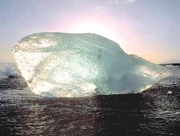
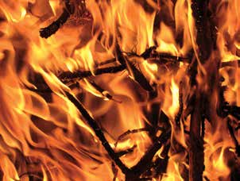
Commons de Atribución-Compartir-Igual 3.0 Unported, 2.5
Commons Genérica de Atribución-Compartir-Igual 3.0
Genérica, 2.0 Genérica y 1.0 Genérica.

173

<!-- Página 175 -->

¿Qué cambios se observan en las ilustraciones? Explica, ¿por qué sucede
Nuestro cada uno de esos cambios?
planeta, la Tierra        
¿Qué sucede cuando una puerta de madera o un pedazo de cartón
están expuestos a la lluvia o al Sol?
   
¿Sabes cuántos ingredientes se necesitan para preparar el mole? Escríbelos.
     174

<!-- Página 176 -->

¿Qué sucede con todos esos ingredientes cuando se prepara el mole?
La naturaleza  
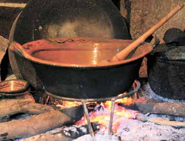
y la sociedad se   transforman      
> [!NOTE]
> Escribe en el paréntesis de la izquierda Sí o No, de acuerdo con lo
> que piensas de cada una de las situaciones descritas. Fíjate en el
> ejemplo.
(  )
Un pedazo de alambre de cobre, ¿cambia su naturaleza? es decir,
¿deja de ser cobre cuando pasa a formar parte de cables para transportar corriente eléctrica?
(  )
El jugo de uva, al fermentarse para convertirse en vino, ¿cambia
su naturaleza?, ¿deja de ser jugo?
(  )
El agua, al descender la temperatura, se congela, ¿deja de ser
agua?
(  )
El carbón que se utiliza para cocinar, al arder, ¿deja de ser
carbón?
(  )
Las verduras que comemos y son digeridas por nuestro organismo,
¿dejan de ser verduras?
175

<!-- Página 177 -->

> [!NOTE]
> Revisa tus respuestas con el grupo y, de ser necesario, explica cada
> una de ellas.
Nuestro planeta, la Tierra
Realiza las actividades de la ficha "Hay de cambios a cambios".
> [!NOTE]
> Subraya y comenta en el Círculo de estudio las ideas principales del
> siguiente texto.
Hay cambios que no afectan la naturaleza o composición química de las
sustancias, es decir, no provocan que una sustancia se transforme en otra;
a esto se le conoce como cambios físicos. Por ejemplo, cuando golpeamos
una roca con un martillo se forman pedazos de roca pequeños y cuando
el agua se congela se transforma en hielo. En ambos casos, hay cambios
únicamente en las características físicas, es decir, en la apariencia o la
forma de la roca y del agua. Por el contrario, existen otros cambios con los
que se puede alterar la naturaleza o composición original de las sustancias.
Por ejemplo, cuando el carbón arde, las cenizas que quedan de él no tienen
las características del carbón, su naturaleza cambió, dejo de ser carbón
para convertirse en ceniza; a estos cambios se les llama cambios químicos.

> [!NOTE]
> Revisen las respuestas de el ejercicio de la página anterior y digan qué
> tipo de cambio se describe en cada situación.
176

<!-- Página 178 -->

¿Qué pasa cuando hervimos agua?
La naturaleza 

y la sociedad se  transforman     
> [!NOTE]
> Revisen sus respuestas y comenten qué cambios se observan en el
> agua y qué los provoca. Anota en tu cuaderno las ideas principales
> de la conversación.
ecordemos que...
Cuando un cuerpo o sustancia recibe

calor, su temperatura aumenta. Entre más se calienta un cuerpo o una
sustancia, las moléculas se mueven con mayor rapidez. Por ejemplo, al
calentar el agua, sus moléculas, que estaban casi en reposo, se mueven
cada vez más rápido hasta que, al hervir, las fuerzas que las mantenían
unidas se rompen y el agua empieza a evaporarse, es decir, pasa al estado
gaseoso. Por el contrario, cuando el agua cambia a hielo, sus moléculas se
mueven cada vez más despacio al estar más juntas.
177

<!-- Página 179 -->

Cambios en el agua por contaminación
Nuestro planeta, la Tierra
El agua potable es indispensable para la existencia de todas las formas
de vida, incluyendo la humana. Ésta es consumida por el ser humano y los
demás seres vivos sin riesgo de contraer enfermedades.
El agua potable puede contener una cierta cantidad de microorganismos
patógenos, minerales y otros elementos químicos; es incolora, inodora,
transparente y de sabor insípido. Con ella se realizan gran parte de
las actividades de la vida diaria

y, debido a los múltiples usos que tiene, es fácil de contaminar.
Las industrias generan cada día más productos químicos para el
aseo del hogar y de las personas, así como para aumentar la producción
de alimentos.
> [!NOTE]
> Qué productos utilizas para limpiar tu casa?
Menciona cuatro.
       178

<!-- Página 180 -->

La utilización de diferentes productos para limpiar nuestra casa cambia las
La
características o propiedades del agua, debido a la suma de com-puestos
naturaleza
químicos que contienen los productos de limpieza y que provocan un cambio
y la sociedad se en la calidad del agua.
transforman
Este cambio en el agua potable podemos reconocerlo al observar la
aparición de un color y un olor en el agua, que no se tenían antes de
agregar el producto de limpieza.
Aunque existen plantas de tratamiento para limpiar el agua, éstas son
insuficientes, por lo que el agua que llega a los ríos, lagos, lagunas y mares
muchas veces está contaminada.

> [!NOTE]
> Comenta con tus compañeros la siguiente pregunta.
¿Qué podríamos hacer para disminuir la contaminación del agua por
productos de limpieza?
abías que...
La espuma de los detergentes contiene sustancias químicas que al acumularse
en los ecosistemas acuáticos provocan el incremento de algas y plantas,
como el lirio, que limitan la producción del oxígeno necesario para otros
organismos del lugar.
179

<!-- Página 181 -->

Tanto las plantas acuáticas como las terrestres son organismos autosuficientes
Nuestro
que, a diferencia de los animales, pueden producir sus propios alimentos
planeta, la Tierra
por medio de un proceso químico llamado fotosíntesis, en el que la luz solar
es de gran importancia.

Las algas se pueden percibir como un limo verde azul sobre la superficie
de las aguas estancadas.
Los cambios en la naturaleza
El girasol, una planta que sigue al sol...
> [!NOTE]
> Platiquen en el Círculo de estudio por qué una planta se orienta hacia
> la luz del Sol.
La fotosíntesis es un proceso que llevan a cabo, además de las plantas,
las algas y algunos tipos de bacterias.
180

<!-- Página 182 -->

En la fotosíntesis las plantas transforman la energía solar o luminosa en
La
energía química. El producto principal de ese proceso es la glucosa, un
naturaleza
tipo de azúcar. Para fabricarla, los vegetales necesitan dos compuestos:
y la sociedad se
el agua que absorben por las raíces y el dióxido de carbono* que las
transforman
hojas de las plantas terrestres toman del aire y las acuáticas del que se
encuentra disuelto en el agua.

luz solar oxígeno (O2) dióxido de carbono (CO2) sales minerales
agua
El color verde de las plantas se debe a una sustancia llamada clorofila,
que es la responsable de capturar la energía luminosa para la fotosíntesis;
la clorofila se encuentra dentro de cada célula vegetal.
*Dióxido de carbono: gas que forma parte del aire y que utilizan las plantas durante
la fotosíntesis.
Los animales lo producen como sustancia de desecho de la respiración.
Fuente: Leonor Díaz, Alejandra González, Hilda Infante et al. Ciencias I. Énfasis en
Biología. Primer grado, Vol. I. Telesecundaria, México, sep-ilce, pp. 167-168.
181

<!-- Página 183 -->

Un producto de desecho de la fotosíntesis es el oxígeno, el cual se libera
Nuestro
al ambiente a través de unos poros que se encuentran en las hojas de las
planeta, la Tierra plantas.
De esta manera, así como la gasolina aporta la energía que los automóviles
necesitan para funcionar, la glucosa proporciona la energía que todos los
seres vivos necesitan para vivir.
En resumen, el proceso de fotosíntesis se representa de la siguiente manera:
> [!NOTE]
> luz solar
> agua   +   dióxido de carbono
> glucosa   +   oxígeno
> Gas que es absorbido
> Entra por
> clorofila
> Producto que
> Gas que
> del aire por las hojas.
> las raíces.
> proporciona la
> se libera al
> energía química
> ambiente.
> Transformación que
> que la planta
> requiere la presencia
> necesita.
> de luz solar y clorofila.
¿Cómo contribuyen al desarrollo de la vida en la Tierra algunos de los
cambios que ocurren en las plantas?
       182

<!-- Página 184 -->

> [!NOTE]
> Revisen sus respuestas y, de ser necesario, amplíenlas o modifíquenlas
> de acuerdo con la información de la Unidad 2 de este módulo.
La naturaleza y la sociedad se
Las plantas no tienen ojos, nariz u oídos como otros seres vivos. Sin embargo,
transforman
son capaces de percibir características del ambiente, por ejemplo, la fuerza
del viento, la cercanía de un organismo, la presencia, intensidad y duración del
sol. Incluso son capaces de reaccionar ante esas propiedades ambientales.
Por ejemplo, una planta cerca de una ventana se orienta o busca la luz del
sol. Esta reacción es controlada por sustancias químicas u hormonas que
produce la planta y que hacen que ésta se dirija o crezca en dirección al sol;
este fenómeno se llama fototropismo.
Las plantas también perciben, reconocen la hora del día y la época del
año. Regulan su descanso durante los periodos de oscuridad y, en el día,
producen néctar para atraer a insectos que les ayudan en el proceso de
reproducción. Cuando los días se acortan y el otoño se acerca, algunos
árboles y plantas pierden sus hojas para evitar la pérdida de agua, es
decir, se preparan para las inclemencias del invierno.

Los días cortos del otoño son la señal para cambiar.
183

<!-- Página 185 -->

> [!NOTE]
> Conversen acerca de comportamientos de animales que estén
> relacionados con las estaciones del año. Después, anota en tu
> cuaderno los comportamientos que más te interesen.
Nuestro planeta, la Tierra

> [!NOTE]
> IJsberen op Spitsbergen, Martha de Jong-Lantink, Fotopedia.
Al acercarse el invierno, algunas aves
Los osos duermen durante largas temporadas viajan o migran a otros lugares en busca de
alimento y mejores condiciones ambientales.
¿Por qué influyen los cambios de estación en los seres vivos?
   
¿Por qué crees que los seres humanos crearon, desde tiempos remotos,
instrumentos para medir el tiempo?
    184

<!-- Página 186 -->

> [!NOTE]
> Revisen sus respuestas y comenten la siguiente pregunta: qué da origen
> al día, a la noche y a las estaciones del año? Escribe en tu cuaderno los
> comentarios que te parezcan más interesantes.
La naturaleza y la sociedad se transforman ara saber
Consulta en tu Revista el texto “Los ciclos en la Tierra”.
más...
> [!NOTE]
> Conversen acerca de los cambios que se efectúan en la superficie y
> en lo profundo de la tierra firme, las acumulaciones de agua, en los
> gases que forman el aire.
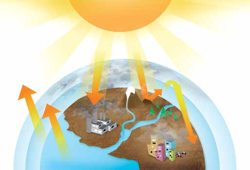
Lee el siguiente texto y subraya las ideas principales.
## E
n el planeta se presentan continuamente cambios o modificaciones en la
tierra, el agua y el aire. Algunos de esos cambios se manifiestan mediante
la actividad volcánica, tempestades, sismos o temblores, formación de grietas
y cadenas montañosas en los fondos marinos, acumulación de gases que
pueden ser tóxicos, transformación de algunos de los componentes, vivos o
no vivos. Esos cambios hacen que la Tierra, en su totalidad, se encuentre en
transformación constante.
185

<!-- Página 187 -->

> [!NOTE]
> Explica en tu cuaderno cómo se relacionan algunos de esos cambios.
Nuestro planeta, la Tierra
Revisen sus respuestas y mencionen alguno de los ciclos revisados en la
Unidad 2. Por ejemplo, el ciclo de vida de una planta o un animal. Explica
brevemente algunas de sus características.
      
Observa la siguiente ilustración.
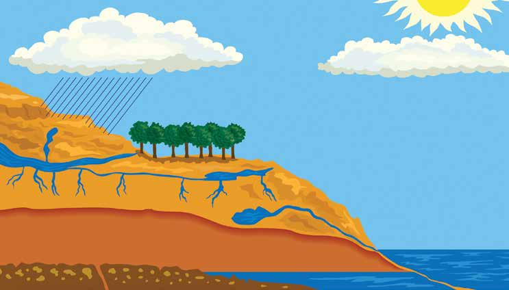
> [!NOTE]
> Nubes de lluvia
> Formación de nubes
> Precipitación
> Evapotranspiración
> Evaporación
> Río
> Arroyo
> Infitración
> Manantial
> Aguas subterráneas
> Infiltración al océano
> Océano
186

<!-- Página 188 -->

> [!NOTE]
> Conversen acerca de las siguientes preguntas.
La naturaleza
¿Qué cambios observas en el agua en la ilustración anterior?
y la sociedad se
¿Qué importancia crees que tienen esos cambios para la vida?
transforman
¿Cuándo empieza y termina este ciclo?
> [!NOTE]
> Anota en tu cuaderno las ideas principales de la conversación.
Busca en un periódico o revista una noticia relacionada con alteraciones
al ciclo del agua. Después, pégala en tu cuaderno y anota las causas y
consecuencias de esas alteraciones.

U.S. Navy photo. wikipedia
Vista de Sendai, inundada tras el terremoto de 2011 y el posterior tsunami.
¿Crees que los cambios en el ciclo del agua tienen consecuencias en la
vida? ¿Por qué?
     187

<!-- Página 189 -->

ara saber
Consulta en tu Revista el texto “Otros cambios cíclicos”.
más...
Nuestro planeta, la Tierra
Elabora en tu cuaderno un texto con las ideas centrales del artículo de
la Revista.
ecordemos que...
El ser humano, desde épocas remotas, se ha preguntado acerca de las
causas que provocan diversos cambios que ocurren en la naturaleza. Como
resultado de la observación, el registro de información, la experimentación
y la consulta persistente se han reconocido algunos factores que influyen
en la naturaleza física o química de un objeto, un ser vivo o un fenómeno
natural. La luz, el calor, el viento, el movimiento del agua, entre otras
causas, provocan transformaciones en la materia.
Los cambios cíclicos propician y dan continuidad a todos los procesos que
hacen posible el desarrollo de la vida. Mantienen y garantizan la renovación
del ambiente. Esto sucede siempre que la acción de otros factores naturales
o provocados por el ser humano no dificulten o impidan la renovación.

Federal Emergency Management Agency. wikipedia 188

<!-- Página 190 -->

> [!NOTE]
> La energía y su relación
La naturaleza con el cambio
Tema y la sociedad se
> [!NOTE]
> La palabra energía es parte de nuestro lenguaje cotidiano; decimos: “se
> me acabó la energía”, “a este niño le sobra energía”, “la energía eléctrica
> es parte del desarrollo de los pueblos”, “hay alimentos que me dan más
> energía”, pero, ¿qué otros significados puede tener la palabra energía?
> ¿Qué tipos de energía existen? ¿Cómo se relaciona la energía con los
> cambios de la naturaleza?
transforman ara empezar…
El mismo Sol que decolora las flores caídas en el pasto, alza la bugambilia.
En el borde del árbol la hoja abandona su color y dice sobre la cal del muro su silencio.
Suena el espacio.
Vive el insecto en el césped su mundo de espadas.
Pausa de pájaros.
Corren niños y perros.
Antonio Deltoro, poeta mexicano.
¿A qué se refiere el poema anterior?
¿Qué hace que la bugambilia crezca?
¿Qué hace posible que niños y perros corran?
189

<!-- Página 191 -->

> [!NOTE]
> Escribe tus respuestas en tu cuaderno. Después, platica con tus
> compañeros acerca de ellas y, en grupo, traten de definir qué es
> energía. Pueden consultar un diccionario. Anota la conclusión a la
> que llegaron.
Nuestro planeta, la Tierra   
Piensa acerca de las actividades que realizas diariamente desde que te
levantas: ¿Qué te permite preparar tu desayuno? ¿Qué hace posible que
puedas trabajar?
Observa las siguientes ilustraciones.

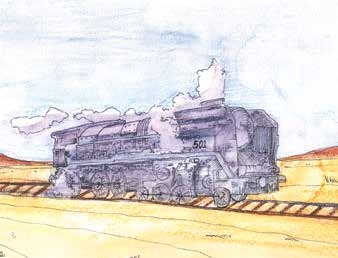
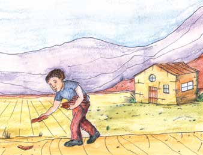
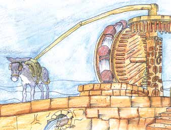
190

<!-- Página 192 -->

> [!NOTE]
> Comenten la siguiente pregunta.
La naturaleza
¿Qué hace posible que una persona, animal o máquina realice un trabajo?
y la sociedad se
Anota la conclusión a la que llegaron.
transforman    
Traza una ✓ en aquellas palabras que relaciones con la palabra energía.
Fíjate en el ejemplo.
fuerza ✓ átomo voluntad movimiento agua sol cambio persona carbón
molino luz alimento trabajo azúcar calor
Explica en tu cuaderno por qué marcaste esas palabras.
Lee el siguiente texto y comenta las ideas más importantes.
## L
a energía se define como la capacidad para hacer un trabajo, y está
estrechamente vinculada al cambio. La energía es una propiedad de los
objetos, que permite explicar los cambios en la interacción de un objeto
con otro. Por ejemplo, para mover un balón de futbol interactúan tu pie
y el balón: el pie transfiere energía al balón al golpearlo para ponerlo en
movimiento. Durante la interacción de tu pie con el balón, es decir, durante
el golpe, se aplicó una fuerza que produce el desplazamiento del balón. Así,
al aplicar una fuerza para poner en movimiento el balón hubo un gasto de
energía, por ello se dice que el trabajo es el resultado de aplicar una fuerza.
191

<!-- Página 193 -->

ara
Consulta en tu Revista el artículo “Tipos de fuerzas”.
saber más...
Nuestro planeta, la Tierra
Traza una ✗ sobre el número de la ilustración que crees representa la
capacidad de hacer un trabajo.

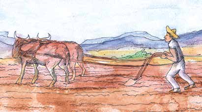
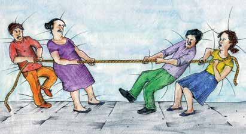
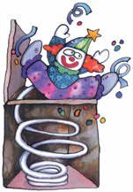

> [!NOTE]
> Revisa con el grupo tus respuestas y comenta las siguientes preguntas.
- En la ilustración número 1, ¿se realiza trabajo?
- En la ilustración número 3, ¿quién hace trabajo?
- Si ninguno de los grupos representados en la ilustración número 4
fuera capaz de mover al otro, ¿se realizaría trabajo?
Se realiza trabajo sólo cuando hay un desplazamiento. Así, en las ilus-
traciones anteriores se observa que la persona representada en la
ilustración número 1 ejerce una fuerza sobre la caja, pero por más
192

<!-- Página 194 -->

intentos que hace no es capaz de moverla; por tanto, no hace trabajo.
La
Un objeto, como el resorte de la ilustración 3, puede realizar trabajo. La
naturaleza
energía es lo que le da al resorte la capacidad para hacer trabajo, es
y la sociedad se
decir, para levantar el muñeco en el momento en que se destapa la caja.
transforman
La energía fue transmitida al resorte cuando una fuerza lo comprimió.
Es posible dar energía a un cuerpo que no la tiene.
> [!NOTE]
> Escribe con tus propias palabras la definición de energía; utiliza
> algunos de los ejemplos de las actividades anteriores.
       
> [!NOTE]
> Comenten sus respuestas. Después, conversen acerca de las diferentes
> manifestaciones de energía que se conocen. Anota tres de ellas.
1. 

2. 

3. 
 193

<!-- Página 195 -->

> [!NOTE]
> Escribe en tu cuaderno la importancia que tienen los distintos tipos
> de energía para realizar las actividades de tu vida diaria.
Nuestro planeta, la Tierra
Observa y comenta qué tipos de energía se ilustran.

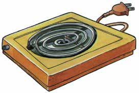
Existen distintas formas de energía; todas ellas se encuentran estrechamente
relacionadas con la vida en la Tierra. Entre ellas se encuentran las siguientes:
solar, eléctrica, química, calorífica o térmica, eólica o producida por el
viento, de las olas del mar, cinética o del movimiento, nuclear, geotérmica
o del calor interno de la Tierra.
> [!NOTE]
> Escribe en tu cuaderno las tres formas de energía más utilizadas
> en tu comunidad y los principales usos que se le da.
194

<!-- Página 196 -->

> [!NOTE]
> Responde en tu cuaderno: cuál es la energía más costosa?, cuál
> es la más difícil de obtener?, qué podemos hacer para cuidar su
> consumo?
La naturaleza y la sociedad se transforman
> [!NOTE]
> ¡Ahorremos energía eléctrica!
> •	 Junta y trata de planchar de
> una sola vez la ropa. Primero
> plancha la ropa que necesita
> menor cantidad de calor.
> •	 No seques la ropa con la plan-
> cha, utiliza el calor del sol.
> •	 Aprovecha la luz natural, la del
> sol. Siempre que sea posible
> trabaja junto a una ventana.
> •	 Pinta las paredes y el techo de
> color blanco o de colores cla-
> ros, esto mejora la iluminación.

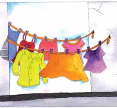
> [!NOTE]
> 195

<!-- Página 197 -->

La energía del Sol
Nuestro planeta,
> [!NOTE]
> Comenten acerca de las transformaciones de energía representadas
> en la ilustración. Recuerdas lo que ocurre en las plantas verdes
> gracias a la energía solar?
la Tierra
> [!NOTE]
> ¡Ahorremos energía eléctrica!
> Para utilizar menos el
> aire acondicionado y la
> calefacción, siembra árboles
> frondosos en los lados sur
> y oeste de tu casa. Éstos
> mantendrán un clima
> agradable en el verano y la
> protegerán en el invierno.
Las transformaciones de la energía solar
> [!NOTE]
> Escribe un uso que se da a la energía del Sol.
     196

<!-- Página 198 -->

> [!NOTE]
> Comenten las siguientes ilustraciones.
La naturaleza y la sociedad se
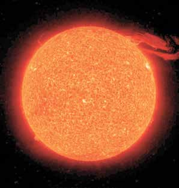

NASA transforman
Commons Genérica de Atribución/Compartir-Igual 3.0.
También se puede obtener energía
El Sol, fuente de energía natural.
a través de celdas solares.
Vitamina D
El Sol contribuye a fortalecer nuestros huesos.
197

<!-- Página 199 -->

Lee el siguiente texto y escribe en tu cuaderno tres ejemplos de cómo los
Nuestro seres vivos transformamos la energía que recibimos del Sol.
planeta, la Tierra
## E
l Sol es nuestra principal fuente de energía. Las plantas utilizan
aproximadamente 2 % de la energía solar que llega a la Tierra. Con ella
elaboran miles de millones de toneladas de alimentos. Las plantas y sus productos
son consumidos por los animales y los seres humanos, quienes transformamos
este alimento en energía para movernos, realizar diferentes actividades y eliminar
una parte de ésta en forma de calor.

> [!NOTE]
> ¡Ahorremos energía eléctrica!
> Apaga focos o aparatos
> eléctricos cuando no hagas
> uso de ellos.
abías que...
La luz que llega a nuestras casas proviene generalmente de las plantas
hidroeléctricas. Estas plantas requieren de la construcción de presas con grandes
cantidades de agua para generar la energía; sin embargo, el agua que se guarda
en las presas disminuye la cantidad que llega a los ríos, lagos y lagunas. Si puedes
utilizar la energía del Sol, hazlo; ésta no contamina, ni el aire ni el agua.
> [!NOTE]
> Escribe en tu cuaderno tres ejemplos de cómo los seres vivos
> transformamos la energía que recibimos del Sol.
ara
Consulta en tu Revista el texto “Distintos tipos de energía”.
saber más...
198

<!-- Página 200 -->

Energía térmica o calorífica
La naturaleza
El calor es otra forma de energía, y la sociedad se
¿Qué usos tiene?
transforman

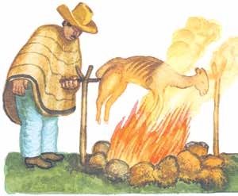
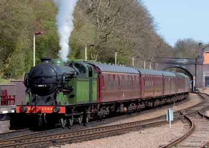
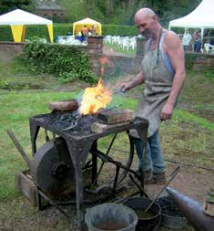
Tony Hisgett. wikipedia
¿Cómo utilizas diariamente este tipo de energía?
     199

<!-- Página 201 -->

¿Ayuda a la digestión cocinar ciertos alimentos?
Nuestro planeta, la Tierra
Sí     No
¿Por qué?
   
> [!NOTE]
> Comenten sus respuestas. Después, reflexionen sobre qué sucede
> con la energía calorífica cuando un metal, comida u otra sustancia se
> calienta o se quema.
> Escoge uno de los comentarios más importantes y escríbelo en tu
> cuaderno.

> [!NOTE]
> ¡Ahorremos energía!
> Cocina los alimentos con la
> flama más baja posible y tapa el
> recipiente. La tapa conserva el
> calor en el recipiente. Una flama
> intensa calienta el aire alrededor
> del recipiente y esto es un
> desperdicio innecesario. Cuida la
> energía y tu bolsillo.
200

<!-- Página 202 -->

> [!NOTE]
> Escribe el nombre de los combustibles que más se usan en tu
> comunidad.
La naturaleza y la  sociedad se transforman    
> [!NOTE]
> Revisen su respuesta y comenten la siguiente pregunta.
¿Desde cuándo se utilizan esos combustibles? Menciona qué cambios
favorables y desfavorables han causado en el ambiente.
La observación de los distintos cambios que produce el calor llevó a
algunos científicos a pensar en la posibilidad de utilizar esta fuente
de energía para usos diversos. En el siglo xviii, James Watt inventó la
máquina de vapor. Este invento fue el inicio de grandes cambios para la
humanidad; a partir de la máquina de vapor surgió la locomotora y se
modificó el transporte, el comercio, la industria y la minería. Esto generó
un aumento en el uso de un combustible: el carbón.
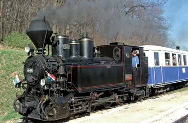
József Süveg. wikipedia
Los cambios propiciados por la máquina de vapor marcaron una etapa conocida como la Revolución
Industrial, que se  inició en Inglaterra, se extendió por el resto de Europa
y, más tarde, por otras partes del mundo.
Locomotora de vía estrecha.
201

<!-- Página 203 -->

¿Qué cambios trajo el uso de la máquina de vapor?
Nuestro planeta,  la Tierra     
> [!NOTE]
> Comenten el texto anterior y mencionen algunos cambios nocivos en
> el ambiente provocados por el desarrollo industrial.
¿Cómo imaginas que afecta a la Tierra el calor que se libera de las
fábricas y transportes?
   
La Tierra tiene calor
¿Has escuchado hablar de que la Tierra se está calentando o de que el
clima está cambiando?
Desde hace algunas décadas, varios investigadores han reportado un
aumento en el bióxido de carbono, como consecuencia del incremento
en el número de automóviles, aviones, fábricas y la disminución de los
bosques. Los medios de transporte y las industrias producen bióxido de
202

<!-- Página 204 -->

carbono (CO2) y otros gases al quemar combustibles fósiles, que son los
La
que utilizan para su funcionamiento. El aumento en estos gases genera
naturaleza
graves consecuencias para el medio ambiente de la Tierra, como el efecto
y la sociedad se invernadero y el cambio climático.
transforman
El bióxido de carbono forma una cubierta que envuelve a la Tierra y
retiene mayor cantidad de luz solar; como consecuencia, el aire que rodea
a la Tierra se calienta. A esto se le conoce como efecto invernadero.
A los cambios ambientales que se presentan en la Tierra por el efecto
invernadero, se les conoce como cambio climático.

Radiación
Radiación
Radiación solar 102 de baja solar reflejada 239 frecuencia entrante
saliente
Reflejada por las nubes, aerosoles y la atmósfera 341
Ventana 169 79 W/m2
Absorbida atmosférica por la
Emitida atmósfera por la atmósfera
Gases efecto
Calor invernadero latente
Reflejada por la superficie 356 333
Radiación 161 retornada 396
Evapo-
Convección
Radiación
Absorbida 333 trans de la por la
Absorbida piración superficie superficie por la superficie
Absorción neta 0,9 W/m2
Balance anual de energía de la Tierra desarrollado por Trenberth, Fasullo y Kiehl de
la NCAR en 2008.
203

<!-- Página 205 -->

> [!NOTE]
> Investiga con algún profesor de Biología o Geografía o consultando
> alguna página de internet, cuáles son las consecuencias del efecto
> invernadero y del cambio climático? y, qué medidas se están aplicando
> para reducir dichos problemas ambientales? Con esta información,
> completa la siguiente tabla.
Nuestro planeta, la Tierra
> [!NOTE]
> Efecto invernadero
> [!NOTE]
> consecuencias
> medidas
> [!NOTE]
> Cambio climático
> [!NOTE]
> consecuencias
> medidas
204

<!-- Página 206 -->

De las medidas establecidas contra el efecto invernadero y el cambio
La
climático, elige aquellas que puedes aplicar de manera personal y que
naturaleza estás dispuesto a comprometerte a realizar.
y la sociedad se transforman     
> [!NOTE]
> Comenta tu respuesta con tus compañeros.
ara
Consulta en tu Revista el texto “El calentamiento de la Tierra”.
saber más...
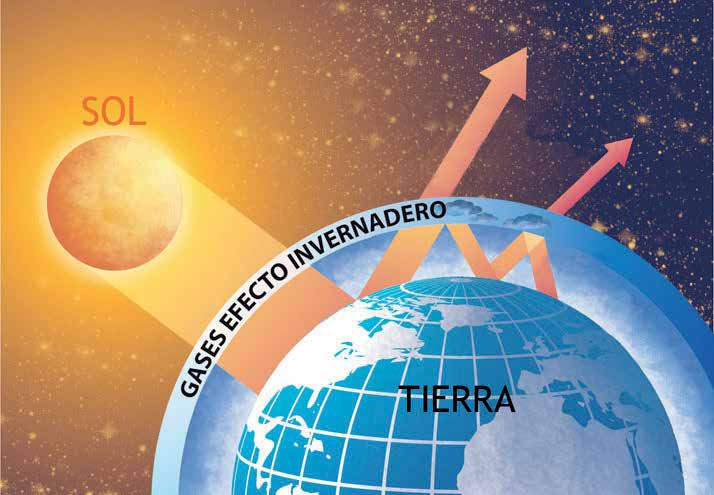
La radiación solar es reflejada por la atmósfera y la superficie terrestre
ATMÓSFERA 205

<!-- Página 207 -->

La electricidad, fuente de energía
Nuestro planeta, la Tierra
Haz un inventario de objetos o aparatos relacionados con la energía
eléctrica y los usos que se les da. Fíjate en el ejemplo.
Objeto o aparato
Uso
> [!NOTE]
> foco
> radio
> [!NOTE]
> para alumbrar
> [!NOTE]
> Imagina qué sucedería si no hubiera energía eléctrica. En tu cuaderno,
> escribe las ideas principales de tu reflexión.
Revisen sus respuestas. Después, comenten la siguiente pregunta: ¿Qué
importancia tiene la energía eléctrica en los cambios de una comunidad?
Anota las opiniones más importantes.
     206

<!-- Página 208 -->

abías
La que...
naturaleza y la sociedad se
En 1881 se inició el servicio público de electricidad en México. Esto
transforman
modificó la forma de vida, en particular, de las poblaciones urbanas.
El molcajete se cambió por la licuadora, el refrigerador de hielo por el
refrigerador eléctrico, las lámparas de petróleo por el foco, los calentadores de
leña por calentadores eléctricos. Las fábricas ampliaron los turnos de trabajo al
poder contar con mejor iluminación y maquinaria con una nueva fuente de
energía. Cambió la vida cotidiana, pero también la forma de trabajar,
producir y consumir. Actualmente la tecnología ha permitido sustituir los
focos incandescentes por lámparas flourescentes compactas que consumen
menos electricidad.
> [!NOTE]
> ¡Ahorremos energía eléctrica!
> •
> Revisa periódicamente que tu instalación eléctrica no tenga fugas.
> Para ello, desconecta todos los aparatos, apaga las luces y observa
> el disco del medidor. Si éste sigue girando, hay una fuga. Llama
> inmediatamente al electricista.
> •
> Sustituye tus focos comunes por lámparas fluorescentes ahorradoras;
> duran 10 veces más y consumen 4 veces menos energía eléctrica.
> •
> Comprueba que la puerta de tu refrigerador selle perfectamente
> colocando una hoja de papel entre ésta y el cuerpo del refrigerador; si
> se desliza al jalarla, hay que cambiar el  sello. Ábrelo lo menos posible.
> •
> Apaga aparatos eléctricos cuando no se estén utilizando.
> •
> Plancha la mayor cantidad posible de ropa en cada ocasión.

207

<!-- Página 209 -->

La electricidad, a diferencia del petróleo y el carbón, no es un recurso
Nuestro
natural; es un producto que el ser humano ha transformado. Llevar la
planeta, la Tierra
energía eléctrica a diferentes lugares ha significado un gran esfuerzo y
tiene un gran costo. Por esta razón es importante usarla racionalmente.
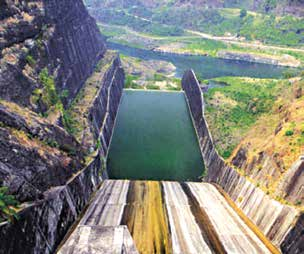
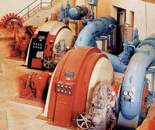

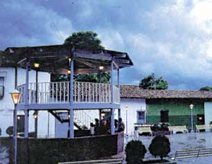
El camino que la luz recorrió antes de que encendieras un foco.
208

<!-- Página 210 -->

Existen varias formas de generar la electricidad. Se puede producir
La
mediante la combustión de gas natural y petróleo, que es la llamada
naturaleza
energía termoeléctrica, la más usada en nuestro país; también mediante
y la sociedad se
la combustión del carbón: energía carboeléctrica; a partir del calor del
transforman
interior de la Tierra: energía geotermoeléctrica; y de la fuerza del viento:
energía eólica. Hasta el momento, no se ha logrado almacenar la electricidad
producida en la naturaleza, por ejemplo, la electricidad de los relámpagos.
ara
Consulta en tu Revista el texto “Energía eólica o del viento para
saber producir electricidad”.
más...
Escribe algunas ventajas de utilizar la energía del viento para producir
energía eléctrica.
   abías que...
Las líneas de distribución en México para llevar electricidad a casas, hospitales,
talleres, escuelas, fábricas, alumbrado público, sistemas de bombeo de agua
potable y drenaje miden más de 500 000 kilómetros, que equivalen a 13.7
vueltas alrededor de nuestro planeta.
> [!NOTE]
> ¡Ahorremos energía eléctrica!
> Para encender y calentar un automóvil, bastan 31 segundos; no aceleres
> en el momento de arrancar. Se ahorra combustible si se maneja a una
> velocidad constante de aproximadamente 80 km/h.
209

<!-- Página 211 -->

La energía nuclear, una energía cuestionada
Nuestro planeta, la Tierra
Lee el fragmento de la siguiente noticia.
> [!NOTE]
> Cientos de japoneses afectados por radiación
> Tokio, Japón, 7 de octubre de 1999.
> US_Navy
> Crece el número de personas que
> fueron expuestas a la radiación en el
> accidente nuclear ocurrido el pasado
> jueves 30 de septiembre en la planta de
> procesamiento de uranio de Tokaimura,
> lugar situado a 140 kilómetros al norte
> de la capital de Japón, Tokio.
> Informes recientes de movimientos
> la localidad autorizó a los habitantes a
> ecologistas afirmaron que: “El número
> regresar a sus domicilios.
> ya se ha elevado a varios cientos de
> Fuentes
> cercanas
> al
> gobierno
> personas. Como resultado del accidente
> aseguraron que no se revisó el sistema
> nuclear, las personas podrían tener
> de seguridad de la planta, a pesar de
> problemas de salud a largo plazo”.
> que ya había ocurrido un accidente
> Se notificó la presencia de tasas
> durante 1997. En ese entonces, decenas
> elevadas de radiación en el lugar,
> de empleados fueron expuestos a
> horas después de que el gobierno de
> radiaciones nucleares.
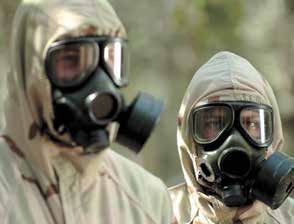
¿Qué opinas del contenido de la noticia anterior?
  
Comenten sus respuestas y digan qué otras cosas saben de la energía nuclear.
210

<!-- Página 212 -->

> [!NOTE]
> En grupo, platiquen acerca de las ventajas y desventajas de usar
> la energía nuclear o atómica. Después, escribe en tu cuaderno las
> conclusiones a las que llegaron.
La naturaleza y la sociedad se transforman
Investiga cuál es su origen y qué otras aplicaciones tiene este tipo de
energía. La contribución de la energía nuclear para satisfacer la demanda
de energía eléctrica a nivel mundial se ha incrementado fuertemente
desde 1954 hasta la fecha. A pesar de que la energía nucleoeléctrica
es relativamente nueva, tiene casi el mismo nivel de producción que la
electricidad obtenida por plantas hidroeléctricas a nivel mundial. En 1997,
la nucleoelectricidad representó aproximadamente 17% del total generado
en todo el mundo, mientras que la hidroelectricidad contribuyó con 18%.
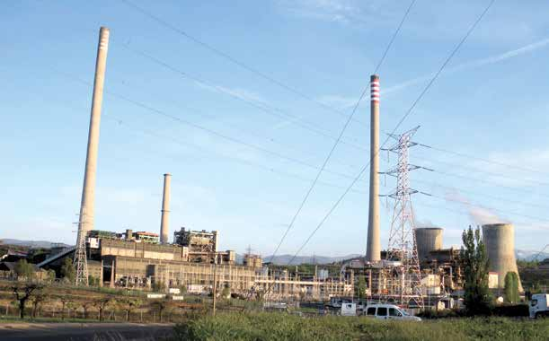
Central térmica de Compostilla II, en Cubillos del Sil, León (España).
211

<!-- Página 213 -->

¿Recuerdas cómo está formado un átomo? ¿Cómo se produce la energía
Nuestro nuclear?
planeta, la Tierra
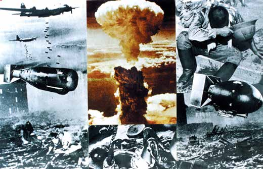
Durante la Segunda Guerra Mundial, se utilizaron dos bombas atómicas que
destruyeron todo a su paso.

Energía

Neutrón

Uranio
Moderador
El uranio, elemento metálico naturalmente radioactivo, es el combustible que se
utiliza para producir energía nuclear.
212

<!-- Página 214 -->

ecordemos que...
La naturaleza y la sociedad se
Existen diferentes tipos de energía: solar, térmica o calorífica, química,
transforman
eléctrica, geotérmica, eólica y nuclear, entre otras. Del total de energía
que se produce, casi la mitad se pierde al ser transformada y transportada,
a esto debemos añadir el mal uso que se hace de ella. Una de las primeras
formas que utilizó el ser humano para obtener energía fue quemando
leña y otros materiales. Después, con la Revolución industrial se empezó
a usar el carbón y, posteriormente, el petróleo y el gas natural. En la
actualidad, hay una distribución y un uso desigual de la energía: si
bien hay sociedades altamente industrializadas que consumen elevadas
cantidades y variedades de energía, en cambio, existen otras que, aunque
son productoras de energía, tienen un consumo mínimo.
Es indispensable que cuidemos la energía y apoyemos el desarrollo y uso
de aquellas que provoquen menos deterioro en el ambiente.
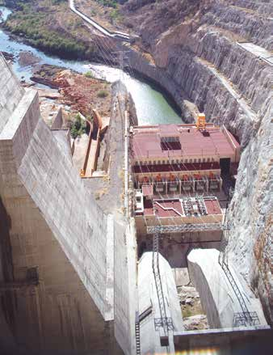

213

<!-- Página 215 -->

> [!NOTE]
> Nuestra influencia en los cambios
Nuestro planeta, tema	 4 de la naturaleza y de la sociedad la Tierra
> [!NOTE]
> Existen diversas maneras en que los seres humanos influimos en la
> transformación de la naturaleza y de la sociedad, de las cuales formamos
> parte. El siglo xx, por ejemplo, se caracterizó por cambios sociales
> importantes y grandes adelantos científicos y tecnológicos, mediante los
> cuales se obtuvieron los principales conceptos de la ciencia moderna,
> entre ellos el conocimiento de que la materia está formada por ciertas
> unidades básicas: el átomo y la célula. También porque ocurrieron
> acontecimientos vergonzosos para la humanidad, como las guerras
> mundiales, la guerra de Vietnam, la guerra en la ex urss...
ara empezar…
Recuerda y reflexiona en relación con las unidades y temas anteriores.
Haz una lista de cambios que han propiciado en la vida de los seres
humanos algunos conocimientos y descubrimientos que la humanidad
ha desarrollado. Fíjate en el ejemplo.
Descubrimiento
Cambios producidos
> [!NOTE]
> Descubrimiento
> Electricidad. Alrededor
> de 1880 se inventaron las
> bombillas eléctricas. La corriente
> eléctrica logró calentar e hizo
> brillar un filamento de metal.
> [!NOTE]
> Las personas dejaron de usar el fuego para
> alumbrarse en la oscuridad, las calles
> pudieron ser iluminadas y fue posible
> realizar otras actividades que antes era
> imposible llevar a cabo.
214

<!-- Página 216 -->

Descubrimiento
Cambios producidos
La
> [!NOTE]
> Rueda. Se inventó hace más de
> 5 000 años; las primeras ruedas
> eran de madera.
> Microscopio. En 1590 se
> inventó el primer microscopio
> compuesto (de dos o más
> lentes), que permitió observar
> objetos invisibles a simple vista.
> Penicilina. En 1928 el científico
> Alexander Fleming descubrió
> un hongo que podía matar las
> bacterias. Esto iba a revolucionar
> el tratamiento de las infecciones.
> Imprenta. En 1450 Johannes
> Gutenberg, herrero alemán,
> inventó la imprenta de tipos
> móviles en Europa.
> [!NOTE]
> Contar con el microscopio y conocer
> acerca de los microbios dañinos para los
> seres humanos permitió crear medicinas
> para combatirlos y así controlar ciertas
> enfermedades.
naturaleza y la sociedad se transforman
> [!NOTE]
> los demás casos en tu cuaderno.
### Cómo fue aprovechada la naturaleza y el conocimiento sobre ella
### para producir los inventos anteriores? Observa el ejemplo y describe
215

<!-- Página 217 -->

Ejemplo:
Nuestro
Cuando se inventó la luz eléctrica, se aplicaron los conocimientos que se
planeta, la Tierra
tenían acerca de las cargas eléctricas que existen en la naturaleza y sobre
la forma en que producen energía, además de la resistencia y consistencia
de los materiales para conducir calor.
> [!NOTE]
> Qué razones tienen los seres humanos para crear inventos?
> Intercambia comentarios con otros integrantes del Círculo de estudio
> e identifica, al menos, dos razones. Anótalas en tu cuaderno.
Los inventos desempeñan un papel importante en nuestra vida. A
veces, facilitándonos lo que necesitamos para vivir, protegiéndonos de
enfermedades o del clima; en otras ocasiones para ahorrarnos un valioso
tiempo y esfuerzo en nuestras actividades cotidianas. La naturaleza se ve
transformada por la acción humana. Se da forma a la madera, al hierro,
al vidrio, produciendo objetos útiles con significado social y de beneficio
general. Es una forma en que los seres humanos desarrollan su capacidad
creativa y satisfacen sus necesidades básicas.
Lee la siguiente noticia.
## L
> [!NOTE]
> a capa de ozono está debajo de su
> La reducción de ozono tiene que ver
> nivel normal; este fenómeno es
> con el aumento en el uso de productos
> conocido como “agujero de ozono”.
> en aerosol. Esto está afectando al
> El ozono forma una pequeña capa
> planeta.
> en la atmósfera terrestre, y protege a
> los seres vivos de los rayos del Sol,
> Los productos en aerosol cuya eti-
> absorbiendo los rayos ultravioleta
> queta indique que no contaminan el
> que pueden provocar, entre otras
> ambiente son los únicos que se deben
> alteraciones, cáncer de piel.
> usar.
216

<!-- Página 218 -->

Muchas personas consideran que los productos en aerosol son de fácil
La
manejo y útiles en la vida diaria. Sin embargo, los costos de su utilización
naturaleza son altos para el ambiente y la vida humana.
y la sociedad se transforman

No daña la capa de ozono
¿Qué debe hacerse para disminuir o evitar el problema que causan esos
productos?
         217

<!-- Página 219 -->

abías que...
Nuestro planeta, la Tierra
La necesidad del ser humano de comunicarse, de dejar huella con sus ideas,
sus problemas, sus técnicas, su trabajo, en fin, con su cultura, dio origen a la
escritura, el gran descubrimiento que permitió que hoy tengamos memoria de
lo sucedido. Los sumerios, habitantes de la llanura que hay entre los ríos Tigris
y Éufrates, ubicada en lo que hoy es Iraq, inventaron la rueda y la escritura y
edificaron las primeras ciudades hacia el año 3 000 a. C.
¿Transformación, enriquecimiento o alteración de la naturaleza?
¿Has escuchado hablar del maíz transgénico?
Sí
No
Si tu respuesta fue afirmativa, explica qué es lo que sabes acerca de este
tipo de maíz.
         218

<!-- Página 220 -->

Lee el siguiente texto.
La naturaleza

## C
y la on técnicas modernas se ha sociedad se logrado producir un tipo de
transforman maíz modificado y diseñado para resistir a los herbicidas y producir
una sustancia tóxica que mata insectos que se alimentan del maíz.
Algunas organizaciones en defensa del ambiente, como Greenpeace,
organización mundial en defensa del ambiente, consideran que los
organismos creados así representan un riesgo para el ambiente, porque son
productos nuevos en la naturaleza, no han pasado la prueba de la
evolución y porque son resultado de procedimientos acerca de los cuales
no hay suficiente información.
¿Qué sabes de la producción de maíz, vegetales u organismos mediante
procedimientos distintos a los que se habían usado hasta ahora?
       219

<!-- Página 221 -->

ara
Consulta en tu Revista el texto “El maíz transgénico”.
saber
Nuestro más...
planeta, la Tierra
> [!NOTE]
> Identifica las ideas principales del texto de la Revista. Comenta con
> tus compañeros acerca de ellas. Escribe algunas de las opiniones que
> te parezcan más importantes.
      
¿Qué tipo de actitud crees que deberíamos de tener ante los distintos
avances de la ciencia y la tecnología? ¿Por qué?
         220

<!-- Página 222 -->

Con nuestra acción, hombres y mujeres participamos en los cambios
La
de la naturaleza y la sociedad. Transformamos los objetos y aplicamos
naturaleza
los principios de la naturaleza en la creación de inventos que nos
y la sociedad se
ayudan a mejorar las condiciones en que vivimos y obtener comodidad,
transforman
satisfacción y bienestar. Otros cambios que provocamos son resultado
de la aplicación de la ciencia y la tecnología aunque, en ocasiones, las
consecuencias son perjudiciales para la vida en el planeta.
Otras formas de cambiar el paisaje
Los cambios que provoca el ser humano tienen consecuencias en el
ambiente y en sí mismo. Por consiguiente, el camino de la humanidad
ha sido difícil, con aprendizajes, descubrimientos, adelantos tecnológicos,
explicaciones y conocimiento científico de los fenómenos naturales, pero
también con retrocesos, errores que se repiten, guerras en las que los
inventos se aplican en forma negativa.
El siglo xx pasará a la historia de la humanidad como el siglo de los enormes
avances científicos y tecnológicos, pero también el de las grandes guerras:
la primera y la segunda Guerras Mundiales.
La Primera Guerra Mundial fue un conflicto internacional ocurrido
entre 1914 y 1918. Durante éste, Alemania, el Imperio austro-húngaro,
Turquía y Bulgaria se enfrentaron a Francia, Gran Bretaña, Rusia, Bélgica,
Serbia, Japón, Italia, Rumania, EUA, Grecia y Portugal, entre otros. En
esta guerra, murieron aproximadamente nueve millones de personas y
cambiaron las fronteras políticas europeas; se formaron nuevos países:
Yugoslavia, Checoslovaquia, Polonia, Finlandia, Estonia, Lituania y Letonia,
naciones que, a partir de esta guerra, proclamaron su independencia.
221

<!-- Página 223 -->

Observa los siguientes mapas de Europa, compáralos e identifica los
Nuestro
cambios que ocurrieron en los límites de los países antes y después de la
planeta, la Tierra
Primera Guerra Mundial. Escribe los cambios en tu cuaderno.
Antes de la Primera Guerra Mundial
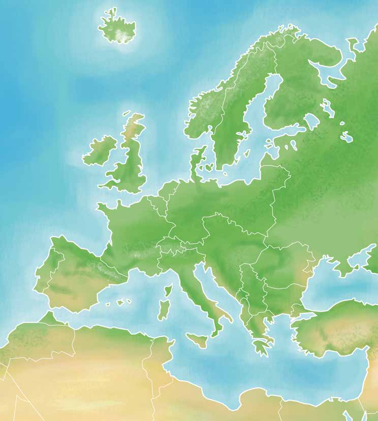
Noruega
Suecia
Mar del Norte
Gran Bretaña
Holanda
Océano Atlántico
Alemania
Bélgica
Rusia
Francia
Austria-Hungría
Suiza
Portugal
Serbia
Rumania
Montenegro
España
Mar Negro
Italia
Bulgaria
Albania
Marruecos francés
Grecia
Imperio otomano
Marruecos español
Túnez
Argelia
Mar Mediterráneo
Libia 222
Egipto

<!-- Página 224 -->

La naturaleza y la sociedad se transforman
Después de la Primera Guerra Mundial

Finlandia
Noruega
Suecia
Mar
Estonia del Norte
Gran Bretaña
Letonia
Lituania
Prusia
Holanda
Océano Atlántico
URSS
Alemania
Bélgica
Polonia
Checoslovaquia
Francia
Austria
Suiza
Hungría
Portugal
Rumania
España
Yugoslavia
Mar Negro
Italia
Bulgaria
Albania
Marruecos francés
Grecia
Imperio otomano
Marruecos español
Túnez
Siria
Argelia
Mar Mediterráneo
Irak
Transjordania
Palestina
Libia 223
Egipto

<!-- Página 225 -->

La Segunda Guerra Mundial fue
Nuestro un conflicto que se vivió de 1939 a planeta, la Tierra
1945. En su afán imperialista Ale- mania, Italia y Japón se enfrentaron
con países aliados:* Gran Bretaña,
Zona
Zona
Francia, EUA, la URSS (Unión de británica
Polonia soviética
Repúblicas Socialistas Soviéticas) y
Alemania otros países. En esta guerra murie-
Alemania
Oriental
Occidental ron más de 40 millones de perso-
Zona nas, de los cuales seis millones fue-
Checoslovaquia americana ron judíos exterminados en campos
Zona francesa de concentración. Los avances de la ciencia y la tecnología fueron uti-
Suiza
Austria lizados como parte de las técnicas militares para consumar el enfren-
tamiento armado.
Océano Atlántico
Esta guerra determinó el reparto
Anexado por la U.R.S.S.
de Europa en dos grandes bloques:
capitalismo y socialismo; así surgie-
Perdido por Alemania ron nuevas alianzas políticas y econó- para Polonia
Portugal micas. En Asia y África se aceleró
Paises de la OTAN la liberación de países que eran ★ considerados colonias europeas.
Paises del Pacto ▼
México participó como aliado en de Varsovia esta guerra con un grupo de pilotos
Fronteras de la llamado el Escuadrón 201.
Posguerra
Cortina de hierro
Marruecos *Aliados: Ligados por algo en común, por una alianza. En este caso se refiere a
un grupo de países que se unieron para enfrentar a otro grupo de naciones.
224

<!-- Página 226 -->

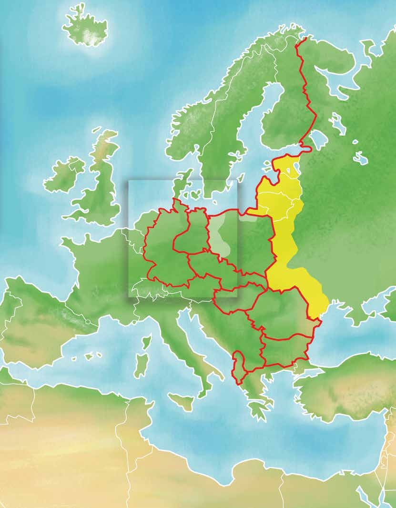
La naturaleza
Variaciones territoriales después de la y la sociedad se
Segunda Guerra Mundial transforman
Mar
Noruega
Finlandia del Norte ★
Suecia
Irlanda
Dinamarca ★ ★
Gran
Países
Bretaña
Bajos
U.R.S.S.
★ ▼ ▼
Alemania
Bélgica ★
Polonia ★
Oriental ▼
Alemania
Checoslovaquia
Occidental ★ ▼
Francia
Suiza ▼
Austria
Hungría ▼
Rumania ★
España
Yugoslavia
Mar Negro
Italia ▼
Bulgaria ▼
Albania ★
Grecia ★
Turquía
Túnez
Argelia
Mar Mediterráneo
Libia
Egipto 225

<!-- Página 227 -->

Observa el siguiente mapa de Europa después de la Segunda Guerra
Nuestro
Mundial y el mapa actual del mismo continente. Escribe en tu cuaderno
planeta, la Tierra
las diferencias que encuentres en la división política de los países.

> [!NOTE]
> Territorio temporalmente
> independiente
> Territorio desmilitarizado
Finlandia
Noruega
Suecia
Mar
Estonia
Irlanda del Norte desde 1922
Letonia
Dinamarca
Gran
Lituania
Bretaña
Océano Atlántico
Prusia Oriental
Holanda (AI)
Bélgica
Alemania
Polonia
Checoslovaquia
Francia
Suiza
Austria
Hungría
Portugal
Rumania
España
Yugoslavia
Córcega (Fr.)
Bulgaria
Italia
Islas Baleares
Cerdeña
Albania (Esp.) (It.)
Grecia
Marruecos
Sicilia (Esp.) (It.)
Argelia
Túnez (Fr.) (Fr.)
Mar Mediterráneo
Tripolitania (Fr.) 226

<!-- Página 228 -->

La naturaleza
Después de la Segunda Guerra Mundial y la sociedad se transforman

Unión Soviética
U.R.S.S.
desde 1922
Ucrania 1917-1920
Mar
Caspio
Georgia
Mar Negro 1918-1921
Azerbayán 1918-1920
Armenia 1918-1921
Turquía desde 1923
Persia
Siria (Fr.)
Irak
Líbano (GB.)
Transjordania
Palestina
Océano Índico (GB.)
Kwait (GB.)
Egipto (GB.)
Arabia 227
Indep. desde 1922

<!-- Página 229 -->

Islandia
Nuestro planeta, la Tierra
División política de los países que conforman Europa en la actualidad
Noruega
Irlanda
Mar
Suecia del Norte
Dinamarca
Reino
Unido
Holanda
Bélgica
Océano Atlántico
Alemania
Francia
Suiza
Portugal
España
Italia
Marruecos
> [!NOTE]
> 1. República Checa
> 2. Austria
> 3. Eslovenia
> 4. Croacia
> 5. Bosnia - Herzegovina
Shara
Argelia
Mauritania
Libia 228

<!-- Página 230 -->

La naturaleza y la sociedad se transforman
Finlandia
Estonia
Letonia
Rusia
Lituania
Bielorrusia
Kazajastán
Ucrania
Uzbekistán
Moldavia
Mar
Rumania
Turkmenistán
Caspio
Georgia
Mar Negro
Azerbaiyán
Bulgaria
Armenia
Turquía
> [!NOTE]
> 6.	 Polonia
> 7.	 Eslovaquia
> 8.	 Hungría
> 9.	 Servia
> 10.	 Macedonia
> 11.	 Albania
> 12.	 Grecia
Irán
Siria
Irak
Israel
Mar Mediterráneo
Jordania
Líbano
Arabia Saudita
Egipto 229

<!-- Página 231 -->

Después de estas grandes guerras, han ocurrido cientos de conflictos
Nuestro
entre muchos países y entre grupos al interior de distintas naciones. La
planeta, la Tierra
necesidad del ser humano por conquistar otros territorios y tener más
poder ha ido de la mano con los avances de la ciencia y la tecnología; sin
embargo, esos inventos también nos han beneficiado. Por ejemplo, el radar
utilizado para detectar submarinos durante la guerra se usa actualmente
para localizar bancos de peces, lo que facilita la tarea de los pescadores.
Algunos de los avances, resultado de la conquista espacial, también nos
han sido útiles, como la producción de alimentos concentrados y de
aparatos empleados en las comunicaciones.

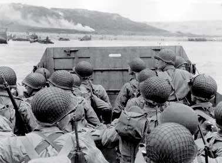
USAAF. wikipedia
Taak. wikipedia
Taak. wikipedia
La ciudad de Wesel en la cuenca del Ruhr,
Batalla de Normandía destruida por los bombarderos aliados.
> [!NOTE]
> Investiga con familiares o amigos en algún libro, revista, periódico
> o video: Cuáles fueron las causas de la Segunda Guerra Mundial?
> Cuánto tiempo duró esta guerra? Cuándo y por qué terminó este
> conflicto internacional? Escribe un texto en el que expliques cuáles
> fueron las consecuencias ecológicas que tuvo esta guerra para los
> países participantes. Comparte la información que investigues con
> tus compañeros del Círculo de estudio.
230

<!-- Página 232 -->

¿Qué hacemos para corregir nuestros errores?
La naturaleza

droit d'auteur. wikipedia
Lee el siguiente texto.
y la sociedad se transforman
## G
reenpeace, organización inter- nacional, ha iniciado una campaña para crear en México un
santuario de ballenas, ante la caza ilegal de éstas y el tráfico y comercio
clandestinos de sus productos. México firmó acuerdos internacionales para

la protección de la ballena y en el artículo 420, fracción 1 del Código
penal se especifican multas a quien de manera dolosa capture, dañe o prive
de la vida a algún mamífero marino o comercialice cualquiera de sus
productos.
Ballena franca glacial.
¿Estás de acuerdo en que intervengan los países o las organizaciones
extranjeras en problemas que son de un país, pero afectan al planeta en
su conjunto?
Sí
No
¿Por qué?
     231

<!-- Página 233 -->

¿Te interesa lo que ocurre en nuestro planeta la Tierra?
Nuestro planeta, la Tierra
Sí
No
¿Por qué?
   
Actualmente se habla de la comunidad internacional , de los ciudadanos
del mundo, de compromisos universales.
¿Qué opinas de que las personas debiéramos ocuparnos de lo que ocurre
en el mundo, sin importar a qué ideología, creencia o país pertenezcamos,
como indican las expresiones anteriores?
     
Tanto las guerras como la contaminación, la tala sin control de los bosques,
los desechos radiactivos, el consumo irracional de energía, la pobreza y la
marginación de muchos pueblos, son producto de la humanidad; por estas
razones, es un compromiso y una obligación de la comunidad internacional
evitar que estos fenómenos continúen.
232

<!-- Página 234 -->

¿Conoces alguna organización nacional o internacional que promueva el
La
cuidado al ambiente, los derechos humanos o la solución de los conflictos
naturaleza armados?
y la sociedad se transforman
Sí
No
Si conoces alguna, anótala y explica qué es lo que promueve para el bien
de la sociedad.
  
En 1945 se creó la Organización de las Naciones Unidas (onu), con la
finalidad de apoyar la resolución pacífica de los conflictos ocasionados
por la Segunda Guerra Mundial, y ayudar al progreso social de los países
miembros de esta organización.
En todas partes del mundo, la Cruz Roja Internacional está presente en
los conflictos. La unicef es un organismo de las Naciones Unidas dedicada
a vigilar que los niños vean satisfechas sus necesidades básicas.
ara
Consulta en tu Revista el texto “Los organismos internacionales”.
saber más...
Antes no teníamos tanta información sobre lo que ocurría en el país y en
otros países del planeta; no sabíamos la responsabilidad que tenemos
cada uno de nosotros al no cuidar a la naturaleza, usar sin medida ciertos
productos y contaminar el ambiente. Ahora, con los medios masivos de
comunicación, las telecomunicaciones y la internet, el mundo está más
comunicado; una ventaja de esto es que pueden conocerse acciones de
diferentes países para cuidar el planeta.
233

<!-- Página 235 -->

El uso de la tecnología y sus desechos
Nuestro planeta, la Tierra
Describe en tu cuaderno algunas formas de cómo se comunicaban las
personas antes, y cómo lo hacemos actualmente.
> [!NOTE]
> Intercambia y comenta tus respuestas. Anota tres de las ideas que te
> parezcan más importantes.
1. 
 
2. 
 
3. 
 
En la actualidad, la lejanía entre países y continentes ha sido práctica-
mente acortada, principalmente por el uso de los diferentes medios de
comunicación y transporte que, a su vez, han apoyado y fortalecido el
intercambio cultural, científico, tecnológico, económico, político y social. La
transformación social avanza a ritmos acelerados en los lugares más
alejados, lo mismo que en las grandes ciudades; las normas de conducta,
los valores, las tradiciones y las costumbres están cambiando.
Hay transformaciones lentas; el ser humano tardó cientos de años en
crear herramientas para el trabajo del campo y actualmente siguen
usándose herramientas muy parecidas a las de nuestros antepasados.
234

<!-- Página 236 -->

¿Crees que en un futuro cercano todo el trabajo se realice con técnicas,
La
herramientas y aparatos modernos? ¿Qué pasará con los hombres y
naturaleza las mujeres que utilizan su fuerza de trabajo para vivir?
y la sociedad se transforman
Reflexiona sobre estas preguntas, dialoga con tus compañeros y com-
pañeras del Círculo de estudio e imaginen qué cambios tendría la
humanidad si la mayor parte del trabajo que realiza el ser humano lo
hicieran las máquinas. Descríbelos en tu cuaderno.
Actualmente se utilizan máquinas que facilitan el trabajo y la producción
de alimentos de los seres humanos; la vida de muchas personas es cada
vez más diferente debido al uso de máquinas y aparatos que se utilizan
en todas las actividades cotidianas, así como en la agricultura, ganadería,
pesca, etcétera.

Aspersor en operación.
235

<!-- Página 237 -->

Las personas utilizan cada vez más aparatos, como teléfonos celulares,
Nuestro
Nuestro
computadoras, radios, entre otros, para mantenerse comunicadas entre
planeta, planeta, la Tierra la Tierra
sí. Sin embargo, es necesario reflexionar sobre cómo ha afectado al
ambiente la utilización de estas novedades tecnológicas, por ejemplo,
¿qué ha pasado con las primeras computadoras que salieron hace unas
décadas?, ¿qué está pasando con la gran cantidad de teléfonos celulares,
televisores, radios y otros aparatos viejos que son reemplazados por los
nuevos que cada día salen al mercado?
> [!NOTE]
> Pregunta a tus compañeros, familiares o amigos qué han hecho cuando
> algún aparato electrónico ya no funciona en casa o se sustituye por
> otro nuevo,  adónde van a dar todos los aparatos electrodomésticos
> que son desechados?, cómo crees que afectan estos desechos al
> ambiente?
Comparte tus respuestas con tus compañeros y juntos hagan propuestas
sobre lo que se puede hacer con esta “basura tecnológica”.
abías que...
En el espacio están girando, alrededor del planeta, cientos de satélites artificiales
que han contribuido a la comunicación entre la población de diversos países;
es por ellos que actualmente podemos conocer las noticias que ocurren al
otro lado del planeta en cuestión de minutos o la trayectoria que tiene un
huracán. También están en construcción estaciones espaciales que realizan
actividades de investigación; sin embargo, estos satélites y estaciones tienen
un límite de funcionamiento en el espacio, cuando ya no funcionan se
precipitan a la Tierra, como fue el caso de la estación espacial rusa mir que
fue desintegrada el 23 de marzo de 2001.
236

<!-- Página 238 -->

ecordemos que...
La
La naturaleza naturaleza y la y la sociedad se sociedad se
Los cambios que producimos, también son consecuencia de actos negativos,
transforman transforman
como las guerras y el ansia de poder. Ante algunos problemas provocados
por la irresponsabilidad y la actitud intransigente de representantes
gubernamentales, es necesario que la sociedad civil se organice y participe
en acciones que demanden el cumplimiento del derecho universal para
lograr mejores condiciones de vida. La organización de los ciudadanos es
necesaria para orientar nuestros esfuerzos hacia el logro de este derecho,
sin lesionar la vida del planeta. Valoremos los avances alcanzados por la
humanidad, pero seamos críticos sobre aquellas situaciones donde estamos
influyendo negativamente, para estar en posibilidad, no sólo de imaginar,
sino de crear mejores condiciones de vida en la sociedad.
Los cambios que se han dado en la actualidad, gracias a los avances
científicos y tecnológicos, también exigen responsabilidad en relación con
los desechos que de ellos se generan. Es necesario formular propuestas
para evitar la contaminación ambiental y el cuidado del planeta en el que
habitamos todos.

237

<!-- Página 239 -->

uestros avances
Nuestro
Nuestro planeta, planeta, la Tierra la Tierra
1. ¿Tiene alguna utilidad saber cómo cambian las cosas en la
naturaleza?
Sí
No
¿Por qué?
      
2. ¿Qué importancia crees que haya tenido para el conocimiento
humano el descubrimiento del átomo?
       238

<!-- Página 240 -->

3. Elabora un cuadro que incluya los principales tipos de cambios
La estudiados y después explícalo a tus compañeros.
Exploremos naturaleza el mundo y la sociedad se transforman
4. Saber que el acero calentado a altas temperaturas se hace flexible
ha servido a los seres humanos para:
 
5. Explica con tus propias palabras qué significa la frase: “La energía
no se crea ni se destruye, sólo se transforma”. Utiliza algunos de los
ejemplos revisados en la unidad.
     239

<!-- Página 241 -->

6. Describe una de las actividades de esta unidad que te haya sido útil
Nuestro
para comprender la capacidad que tenemos los seres humanos de
Nuestro planeta, planeta, la Tierra
producir algún cambio benéfico para la naturaleza o la sociedad.
la Tierra     
7. Escribe una acción que se pueda realizar en tu localidad a favor del
cuidado del ambiente en relación con los desechos tecnológicos.
       240

<!-- Página 242 -->

¿Qué he aprendido y para qué me sirve?
La
Exploremos naturaleza el mundo y la sociedad se
Unidad 3. La naturaleza y la sociedad se transforman transforman
Temas:
1. La naturaleza es diversa; sus cambios, también
2. ¿Por qué cambian las cosas?
3. La energía y su relación con el cambio
4. Nuestra influencia en los cambios de la naturaleza y de
la sociedad
¿Qué aprendí en esta unidad?
   
¿Qué debo repasar?
  
¿Para qué me sirve lo que he aprendido en esta unidad?
   241

<!-- Página 243 -->

> [!NOTE]
> ¿QUÉ NOS
> PROPONEMOS?
> •	Comprender y explicar cómo
> se relacionan entre sí y con su
> ambiente los seres vivos que
> habitan en México y en otras
> partes del mundo.
> •	Reconocer y valorar la
> diversidad de recursos naturales
> y culturales para realizar
> acciones que los conserven
> o recuperen.
> •	Identificar las causas de
> los principales problemas
> ambientales de nuestra
> comunidad y proponer medidas
> para solucionarlos.
> TEMAS
> 1.	México, un país
> de contrastes
> 2.	Los ecosistemas en
> el mundo
> 3.	Cuidemos el patrimonio
> de la humanidad
> 4.	Conservemos la Tierra
> Nuestros avances
> ¿Qué he aprendido y para qué
> me sirve?

<!-- Página 244 -->

## Unidad
## y diversidad
## en la Tierra
### Es común escuchar a las personas decir que
disfrutan de la naturaleza que les rodea, como
Los huma- si ellas no fueran parte de ésta.
nos somos parte de la naturaleza, no estamos en el centro de ella, ni somos observadores
En esta unidad ajenos de lo que sucede.
revisaremos algunas relaciones de mutua dependencia que existen entre poblacio-
nes de personas, animales, plantas y otros componentes del ambiente que hacen posi-
ble la gran diversidad de paisajes y formas de vida que hay en la Tierra, así como también
algunos de los principales problemas am- bientales y cómo podemos participar para
resolverlos.

<!-- Página 245 -->

> [!NOTE]
> México, un país de contrastes
Tema
Nuestro planeta,
> [!NOTE]
> México es un país que tiene una gran diversidad natural y cultural, es
> decir, que a lo largo y ancho del territorio nacional encontramos distintos
> tipos de paisajes, climas, suelos, plantas, animales, personas, formas de
> vestir, vivir, hablar, ser y pensar.
> ¿Qué conoces de esa diversidad? ¿Sabes cómo se relacionan los seres
> vivos con el clima, la luz, el suelo y el agua que hay en el lugar que
> habitan? ¿Qué importancia tiene cuidar la gran variedad de formas de
> vida que hay en México? Busquemos respuestas a estas preguntas al
> realizar las actividades de este tema.
la Tierra ara empezar…
Lean y comenten las instrucciones de la Lotería ecológica y organícense
para jugarla entre los integrantes del Círculo de estudio o con otras
personas.
Anota el nombre de tres animales y tres plantas de la Lotería ecológica
que habiten en forma silvestre en el lugar donde vives o que conozcas.
Plantas
Animales
1. 
1. 
2. 
2. 
3. 
3. 
244

<!-- Página 246 -->

> [!NOTE]
> Describe en tu cuaderno cómo es el lugar donde viven las plantas
> y los animales que escribiste en la actividad anterior y explica qué
> hace distinto ese lugar y sus habitantes de otros lugares representa-
> dos en la Lotería ecológica.
> Revisen sus respuestas y comenten las explicaciones que cada uno
> escribió.
Unidad y diversidad en la Tierra
Observen los lugares ilustrados en cada una de las láminas de la Lotería
ecológica y comenten las siguientes preguntas:
¿Cuáles de estos sitios conocen? ¿Qué saben de ellos? ¿Qué semejanzas
o diferencias encuentran entre ellos?
Escribe en tu cuaderno algunas de las principales diferencias que se
identificaron.

> [!NOTE]
> En México tenemos la mayoría de climas y condiciones de relieve que
> se conocen en el mundo. Aquí vive la décima parte de todas las plantas
> y los animales que existen en la Tierra. Nuestro país ocupa uno de los
> primeros lugares en el mundo por la variedad de aves, mamíferos y
> plantas, y el primero por la gran diversidad de reptiles y cactáceas,
> como las biznagas.

245

<!-- Página 247 -->

Para conocer mejor nuestro ambiente, podemos observar cuidadosamente
todo lo que hay en él; sus componentes vivos y no vivos. Si identificamos bien
Nuestro planeta,
sus características, podremos distinguir más fácilmente las semejanzas, las
la Tierra
diferencias y las relaciones que existen entre todos ellos. Comprender cómo
se relacionan los seres vivos con la tierra, el aire, el agua, la temperatura y la
cantidad de luz, es indispensable para entender que todos los componentes
son partes igualmente importantes y necesarias para dar continuidad a la
herencia más valiosa que nos ofrece la Tierra: la vida.
Conozcamos más de los seres vivos
Observa y compara las plantas de las siguientes ilustraciones.
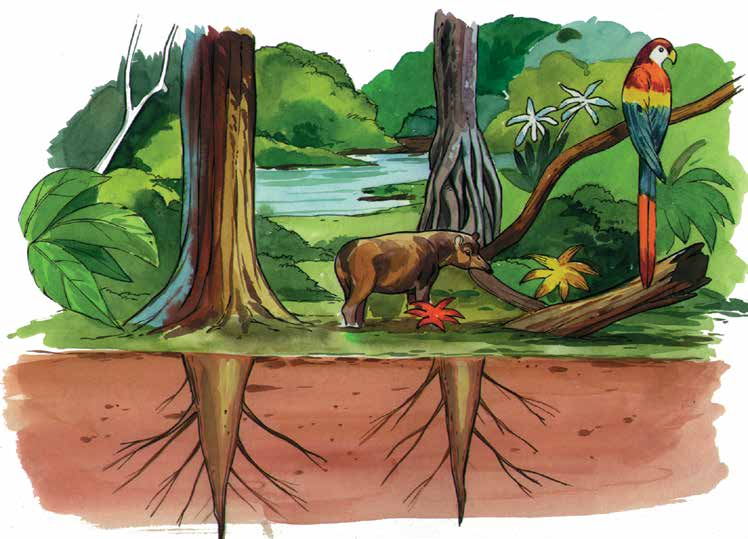
246

<!-- Página 248 -->

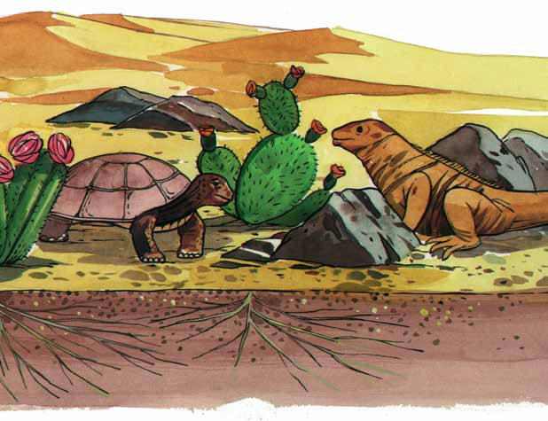
Unidad y diversidad en la Tierra
> [!NOTE]
> Describe en tu cuaderno cómo son las hojas, los tallos y las raíces
> de las plantas ilustradas y explica a qué se deben las diferencias que
> observas. Posteriormente compara tus descripciones con las de otras
> personas del Círculo de estudio y anota una de las explicaciones que te
> parezca más importante.
Subraya las frases con las que estés de acuerdo.
- Las espinas son hojas modificadas que evitan que la planta pierda
agua.
- Las plantas del desierto guardan el agua en sus raíces.
- Cuando llueve, las plantas del desierto almacenan agua en sus tallos.
- En el suelo del desierto el agua se filtra rápidamente y las raíces de
las plantas se extienden para absorber mayor cantidad de agua.
247

<!-- Página 249 -->

> [!NOTE]
> Compara tus respuestas con tus compañeros del Círculo de estudio y
> explica por qué elegiste esas frases. Después, respondan la siguiente
> pregunta.
Nuestro planeta, la Tierra
¿Las características de las plantas tendrán alguna relación con el lugar
donde viven?
     
> [!NOTE]
> Por parejas, seleccionen seis barajas de la Lotería ecológica que
> contengan animales que vivan en la tierra y otros seis que habiten
> en el agua. Fíjate qué partes de sus cuerpos les ayudan a comer, a
> protegerse o a vivir mejor en el medio en el que habitan.
> Anota en tu cuaderno el nombre de dos animales y las características
> que les dan mayores oportunidades de sobrevivir.
> Lee tus respuestas y coméntalas al grupo.
248

<!-- Página 250 -->

¿Alguna vez has visto a un pájaro carpintero?
Unidad y diversidad
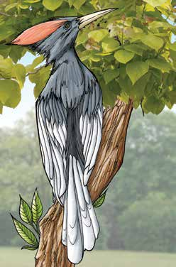
Abundantes plumas en la Tierra
Lengua muy larga y pequeñas impiden que aserrada en la punta.
el aserrín entre en sus orificios nasales.
Dedos con uñas curvas y afiladas; dos
La cola tiene plumas dedos delanteros y muy resistentes que le
dos traseros le sirven sirven para apoyarse para caminar hacia
sobre el tronco.
arriba.
> [!NOTE]
> Comenta con los integrantes del Círculo de estudio las siguientes
> preguntas.
¿Para qué le sirve a este pájaro tener la lengua aserrada? ¿Qué uso da
a sus uñas? Escribe las respuestas en tu cuaderno.
¿Qué sabes de los animales ilustrados a continuación?

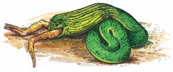
Las serpientes pueden tragar presas
Los murciélagos emiten un sonido que grandes porque sus mandíbulas se
al chocar con el cuerpo de un insecto pueden separar.
produce eco que le permite localizarlo para después comerlo.
249

<!-- Página 251 -->

¿Qué pasaría si el murciélago perdiera las garras de sus patas?
Nuestro  planeta, la Tierra  
> [!NOTE]
> Las personas, al igual que otros seres vivos, se adaptan al ambiente. Fíja-
> te en la forma de vestir de cada persona que está en el mapa y contesta
> en tu cuaderno las siguientes preguntas.
¿Por qué crees que sean distintas? ¿Cómo es el clima en esos estados?
¿Cómo crees que vista la gente que vive en Baja California Sur, Chihuahua
y Yucatán?

Las personas se visten con ropas de materiales propios de cada lugar.
250

<!-- Página 252 -->

> [!NOTE]
> Comenta con los integrantes del Círculo de estudio la siguiente pregunta
> y respóndela en tu cuaderno:
Unidad y diversidad en la Tierra
¿Por qué el ser humano puede sobrevivir en ambientes tan distintos? Anota las
ideas más importantes de la plática.
    

Los seres humanos transformamos el ambiente.
ara
Consulta en tu Revista el texto “La adaptación de los organismos
saber vivos”.
más...
251

<!-- Página 253 -->

De acuerdo con la información que leíste de la Revista explica con tus
palabras, un ejemplo de adaptación de alguna planta o animal al medio
Nuestro planeta, en que habitas.
la Tierra    
A la forma, las funciones del cuerpo y el comportamiento que tiene un
ser vivo y que le ofrece mayores oportunidades para sobrevivir en un
ambiente determinado, se le llama adaptación. Esta característica de los
seres vivos les da mayores posibilidades de supervivencia, es decir, les
permite conseguir sus alimentos, protegerse de las condiciones difíciles
del medio o defenderse de otros organismos para llevar a cabo todas sus
funciones. Los seres vivos heredan a sus descendientes la forma en que
pueden adaptarse a un ambiente y así dan continuidad a su existencia.
Lee la siguiente noticia.

Las mariposas monarca,
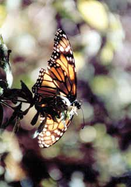
en peligro por la tala de bosques
Toluca, Méx., 29 de agosto de 1999. Las autorida- des del municipio de Donato Guerra han ma-
nifestado su preocupación por la visible dismi- nución del número de mariposas monarca que
cada invierno arriban, procedentes de Canadá, a los estados de México y Michoacán. La causa
principal de este problema ecológico es el incre- mento de la tala clandestina.
252

<!-- Página 254 -->

Las monarcas, que arriban anualmente al ejido El Capulín, ocupan
unas 750 hectáreas de monte y se extienden a lo largo de tres kilómetros
Unidad y diversidad a la redonda.
en la Tierra
En lo que va del año, la policía municipal ha detenido al menos a
una decena de taladores clandestinos, pero luego de consignarlos ante
el Ministerio Público han sido liberados bajo fianza. Otros justifican
el corte de árboles para satisfacer sus necesidades. A estas personas se
les proporciona ayuda material y capacitación para evitar que incurran
nuevamente en estas faltas.
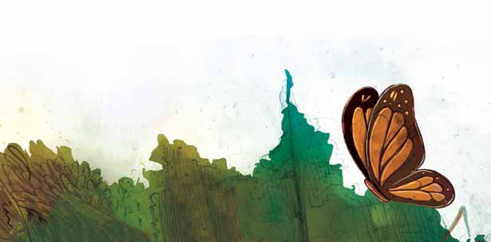
La tala clandestina ya ha acabado con los bosques del lado de
Michoacán y, de no tomarse medidas, se continuará ahora en territorio
mexiquense.
> [!NOTE]
> Identifica las ideas principales de la noticia. Después, coméntalas en
> el grupo y opinen acerca de las siguientes preguntas:
- ¿Qué podría ocurrir con el bosque si continúa la tala?
- ¿Cómo afecta la tala a las mariposas monarcas, a otros animales, al
suelo y a las personas? ¿Por qué?
> [!NOTE]
> Escribe en tu cuaderno las opiniones que te parezcan más importantes.
253

<!-- Página 255 -->

Las plantas ocupan un lugar privilegiado en todos los paisajes. Las hay terrestres y
Nuestro planeta, acuáticas. Algunas son originarias de este la Tierra
país; otras, han llegado de países lejanos.
Como revisamos en unidades anteriores, son alimento de millones de organismos.
También producen oxígeno y fijan el suelo, tienen un importante valor económico,
cultural, ornamental y curativo. Por todo ello, se toman como base para agrupar y
Esta flor mexicana es el nombrar a los distintos paisajes.
símbolo de la Navidad.
Observa las siguientes imágenes. ¿Conoces a los seres vivos que se
muestran en ellas?
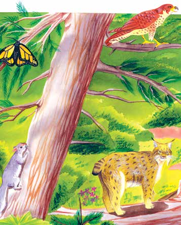

Consulta la siguiente página de internet y juega “Conociendo a otros
mexicanos”: www.conevyt.org.mx/cursos/juegos/con_mex/index.htm
254

<!-- Página 256 -->

### Marca con ✓ el nombre de los animales que viven en el lugar que se
### ilustra a continuación.
Unidad y diversidad en la Tierra

> [!NOTE]
> coyote
> escorpión
> venado
> tucán
> conejo
> pájaro
> halcón
> catarina
> jaguar
> sapo
> carpintero
> oso
> cangrejo
> mariposa
> armadillo
> ocelote
> hormiguero
> tigre
> rana
> avestruz
> ardilla
> cocodrilo
> escarabajo
> rata de campo
> anémona
> codorniz
> zorrillo
> gorrión
> correcaminos
> quetzal
> colibrí
> zopilote
255

<!-- Página 257 -->

Revisen sus respuestas; si tienen dudas consulten las láminas de la Lotería
ecológica.
Nuestro planeta, la Tierra
> [!NOTE]
> Observa en la lámina “Bosque de coníferas” de la Lotería ecológica,
> los organismos que están representados en ella; forma una red ali-
> menticia, utiliza flechas para indicar cómo se relacionan entre sí y
> con su ambiente esos organismos para poder vivir. Si tienes dudas,
> consulta las unidades 2 y 3 de este módulo.
> Revisen sus trabajos y conversen acerca de la importancia que tienen
> los componentes no vivos para que exista la vida. Anota las ideas más
> importantes de la conversación.
           256

<!-- Página 258 -->

Los paisajes de México y sus habitantes
Unidad y diversidad
Identifica con los integrantes del Círculo de estudio en qué estados del
en la Tierra
país se localizan los lugares representados en las láminas de la Lotería
ecológica.
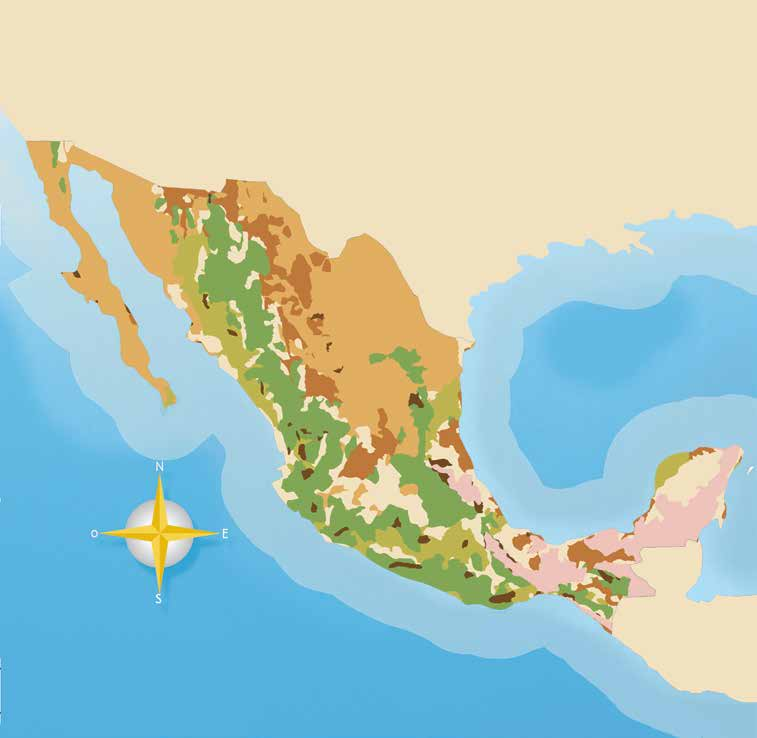
> [!NOTE]
> Matorral xerófilo:
> Zonas áridas y semiáridas;
> desierto
> Selva tropical seca
> Bosque de coníferas
> y encinos
> Pastizales
> Bosque de niebla
> Selva tropical húmeda
> Zona marítima
Ubicación geográfica de ecosistemas mexicanos
Golfo de México
Óceano
Pacífico 257

<!-- Página 259 -->

Explica con tus palabras qué es un ecosistema.
Nuestro  planeta, la Tierra    
> [!NOTE]
> Consulta en un diccionario el significado de la palabra ecosistema.
> Anótalo en tu cuaderno y compara la definición con la tuya.
> Comenten las siguientes preguntas.
> ¿Cuál de los lugares ilustrados en el mapa ocupa la mayor parte
> de extensión del país? ¿Por qué crees que se agruparon de esa
> manera?
> Escribe en tu cuaderno lo que te gustaría saber o investigar de algu-
> no de los sitios que aparecen en el mapa, como: cuál es el clima del
> bosque de niebla, o qué hacen las personas que habitan ahí.
ara saber
Consulta en tu Revista el texto “Los ecosistemas de México”.
más...
> [!NOTE]
> Comenten las ideas más importantes del texto anterior y, con base
> en ellas, completa, de ser necesario, las definiciones de la palabra
> ecosistema que escribieron antes.
258

<!-- Página 260 -->

ecordemos que...
Unidad y diversidad en la Tierra
En México hay paisajes distintos. Éstos se forman por comunidades o grupos
de seres vivos, por ejemplo, microorganismos, hongos, abejas, ardillas, pinos
y personas, entre muchos otros. Existen relaciones entre los seres vivos, así
como entre ellos y la luz, el agua, el aire y la tierra del lugar donde habitan.
Las comunidades de seres vivos de un lugar, los componentes no vivos de
éste, así como las interacciones que existen entre ambos reciben el nombre
de ecosistemas.
Hay ecosistemas grandes, por ejemplo, un bosque; y pequeños, como un
charco. Existen ecosistemas en el aire, en el agua, en la superficie de la tierra
y debajo de ella. Los terrestres se pueden distinguir fácilmente por su clima
y por su vegetación; los acuáticos, por la cantidad de luz y la concentración
de sal que hay en ellos. Ningún ecosistema está aislado. Lo que sucede en
uno de ellos afecta a los otros. Como revisamos en la unidad anterior, en los
ecosistemas la energía se transforma y distribuye constantemente.
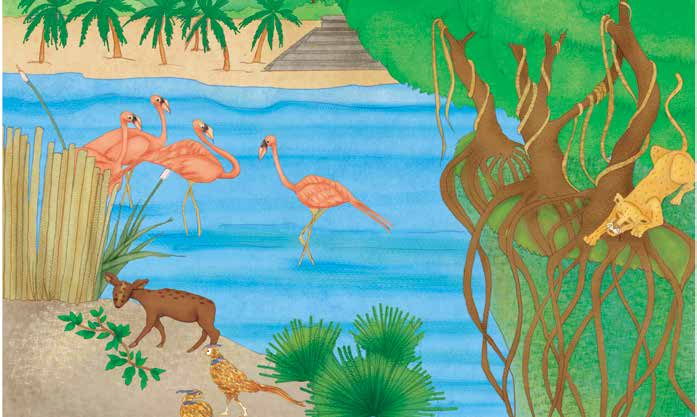
259
