# Tema 2 Los ecosistemas en el mundo

<!-- Página 261 -->

### Tema 2 Los ecosistemas en el mundo
Nuestro
planeta,
> [!NOTE]
> En el mundo existen más de 170 países y en todos ellos hay distintos
> ecosistemas. En sólo 12 países están concentrados de 60 a 70% de la
> diversidad total de vida que existe en la Tierra. México forma parte de
> ese pequeño, pero privilegiado grupo de países.
la Tierra
### ara empezar...
¿En qué lugar te gustaría vivir?
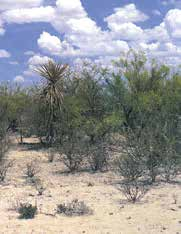

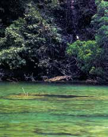
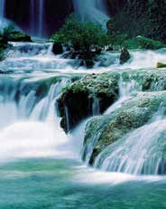

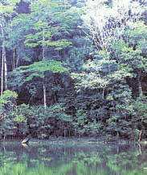
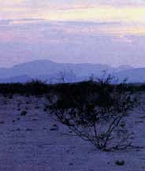

UNIDAD 4
260

<!-- Página 262 -->

Imagina que pudieras vivir fuera de México, en alguno de los lugares
que se observan ilustrados en las fotografías. ¿Cuál escogerías?
Unidad y
diversidad
¿Por qué?
en la Tierra





> [!NOTE]
> Por parejas, elaboren en su cuaderno una lista con la información
> que necesitarían saber para preparar su viaje al lugar que eligieron
> e investiguen en libros o revistas. Por ejemplo, en qué parte del
> mundo se encuentra?, en qué tendrían que viajar?, cuánto tiempo
> tardarían en llegar?, qué ropa llevarían?
> Presenta los resultados de tu investigación a otros integrantes del
> Círculo de estudio y escribe en tu cuaderno las aportaciones y co-
> mentarios que sean de tu interés.

UNIDAD 4
261

<!-- Página 263 -->

Principales ecosistemas en el mundo
Nuestro
planeta,
la Tierra

Distribución
de ecosistemas
> [!NOTE]
> Tundra
> Taiga
> Desierto
> Bosque
> Pradera
> Selva
> Sabana
> [!NOTE]
> Comenta con algun conocido o familiar las siguientes preguntas.
> •	¿Cuáles de los ecosistemas del mapa anterior no se encuentran
> en México?
> •	¿Cómo imaginas que es el clima en esos lugares?
> •	¿Qué sabes de las personas que habitan esos lugares?
UNIDAD 4
262

<!-- Página 264 -->

> [!NOTE]
> Escribe los nombres de plantas o animales que habitan en algunos de
> esos ecosistemas.
Unidad y
diversidad
en la Tierra





¿En cuál de esos ecosistemas crees que tendrías más dificultades para
adaptarte? ¿Por qué? Anota tus respuestas en tu cuaderno. Después,
revísenlas y coméntenlas en el grupo.
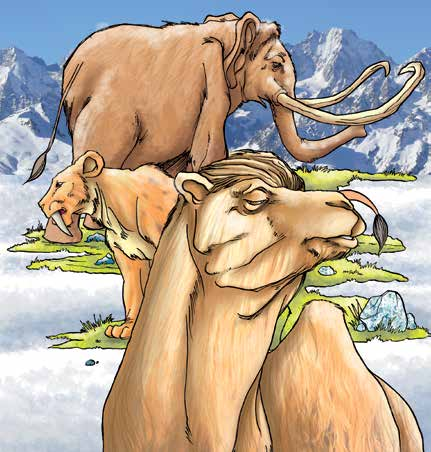
abías
que...
Los antecesores de
los elefantes, leo-
nes y camellos va-
gaban por Alaska
hace 12 000 años.
UNIDAD 4
263

<!-- Página 265 -->

ara
Consulta en tu Revista el texto “Los ecosistemas en el mundo”.
saber
Nuestro
planeta,
más...
la Tierra
¿Cuál de los ecosistemas del mundo te gustó más? ¿Por qué?



Los ecosistemas se agrupan o clasifican tomando en cuenta una o varias
de sus características. Las clasificaciones de los ecosistemas ayudan a
tener un mejor conocimiento de sus componentes y de las relaciones que
hay entre ellos.
Observa detenidamente la siguiente ilustración.
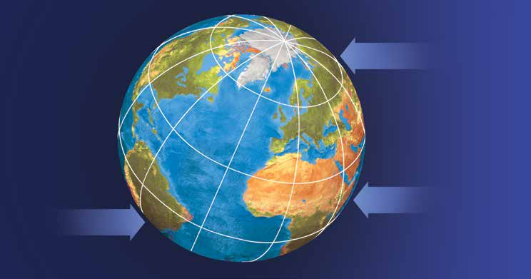
Polo Norte
Ecuador
Polo Sur
Debido a la inclinación y a la forma de la Tierra, la zona del ecuador
UNIDAD 4
recibe los rayos del Sol directamente.
264

<!-- Página 266 -->

¿Cómo imaginas que influye la inclinación con la que llegan los rayos solares a
la Tierra en la diversidad de ecosistemas que hay?
Unidad y
diversidad
en la Tierra




> [!NOTE]
> Comparte tu respuesta con otros integrantes del Círculo de estudio.
Observa el mapa detenidamente y reflexiona la siguiente pregunta: ¿En
qué parte de la Tierra se encuentran los países con mayor diversidad?

UNIDAD 4
265

<!-- Página 267 -->

ecordemos que...
Nuestro
planeta,
Al conjunto total de las formas de vida que existen en la Tierra se le
la Tierra
llama biodiversidad, desde el nivel de las partículas más pequeñas que se
encuentran en un ser vivo, sus genes,* los organismos microscópicos, pasando
por las plantas, animales y personas, hasta llegar a las unidades más complejas
como son los ecosistemas. La diversidad biológica se debe, principalmente,
a las diferencias en la temperatura, el tipo de suelo, la cantidad de lluvia y
a la altitud de un lugar. Todos estos factores, en conjunto, ocasionan una
variedad de climas, condiciones ambientales y formas de vida.

UNIDAD 4
*	Genes: A través de ellos se transmiten o heredan las características de una
generación a otra; se localizan en el núcleo de una célula.
266

<!-- Página 268 -->

> [!NOTE]
> Cuidemos el patrimonio
Unidad y
diversidad
3	 de la humanidad
Tema
en la Tierra
> [!NOTE]
> Los seres humanos hemos cambiado el ambiente muy rápidamente;
> tenemos maneras muy exitosas de adaptarnos a él. Gracias a esto, muchas
> personas pueden vivir rodeadas de comodidades, pero, ¿cuál es el costo?,
> ¿cuánto más se ha de cambiar el ambiente antes de reconocer que día a día
> se destruye el patrimonio natural y cultural de distintas partes del mundo?
> Es decir, se destruyen las riquezas o bienes naturales y los hechos por el ser
> humano que, en su conjunto, forman el patrimonio de la humanidad.
ara empezar…
Observa la siguiente imagen.

Esto queda en gran parte de las selvas del mundo.
UNIDAD 4
¿Es grave el problema?
267

<!-- Página 269 -->

> [!NOTE]
> Imagina qué ocurriría si cada una de las personas cortara un árbol,
> tirara basura en las calles y desperdiciara el agua. Comparte tu
> opinión con integrantes del Círculo de estudio y escribe las ideas
> más importantes en tu cuaderno.
Nuestro
planeta,
la Tierra

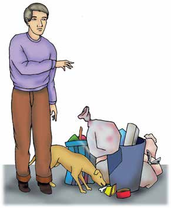
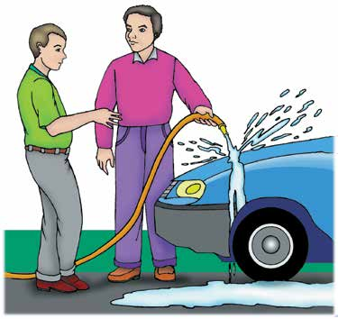
UNIDAD 4
268

<!-- Página 270 -->

Contaminación y otros
problemas del ambiente
Unidad y
diversidad
en la Tierra
Lee el siguiente texto.
## L
os seres humanos compartimos características con otros seres vivos,
pero al mismo tiempo somos diferentes, pensamos, sentimos, hablamos,
podemos expresar nuestros sentimientos de formas distintas. Usamos nuestra
inteligencia para obtener comida, agua, para construir nuestras viviendas en
cualquier lugar y tipo de clima. Sin embargo, en la búsqueda de satisfactores
a nuestras necesidades dañamos o destruimos el lugar que habitamos y, con

él, a todos los ecosistemas de la Tierra.
¿Qué actitudes humanas crees que deterioran el ambiente?


UNIDAD 4

269

<!-- Página 271 -->

### Observa las siguientes fotografías.
Nuestro

planeta,

la Tierra
Smog, Simone Ramella, Fotopedia.
Marine Photobank. Este archivo está
Commons Attribution 2.0 Generic.

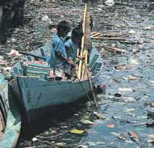
Komencanto. Este archivo está autorizado bajo la
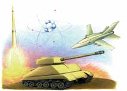
> [!NOTE]
> Comenta con otros integrantes del Círculo de estudio las siguientes
> preguntas.
> contaminación conocen?
> Pregunta a dos o tres personas que no asistan al Círculo de estudio
> qué entienden por contaminación y qué formas de contaminación
> conocen. Anota las ideas más importantes en tu cuaderno.
> Presenta en el Círculo de estudio los resultados obtenidos y conver-
> sen acerca de las causas que provocan cambios perjudiciales en el
> agua, el aire y la tierra.
### ¿Qué formas de contaminación encontraron? ¿Qué otras formas de
### La contaminación puede entenderse como un cambio que altera de
### manera nociva las características del agua, del aire o de la tierra, dañando
UNIDAD 4
### el ambiente físico y a los seres vivos que lo habitamos.
270

<!-- Página 272 -->

Los elementos que contaminan el aire, el agua o la tierra son, principalmente,
residuos de objetos o sustancias que utilizamos y arrojamos, sin control
Unidad y
diversidad
alguno, al ambiente como resultado de las distintas actividades que
en la Tierra
diariamente realizamos, así como del transporte, la industria, la agricultura,
entre otros.
> [!NOTE]
> Escribe en tu cuaderno los principales problemas de contaminación
> del aire, la tierra o el agua del lugar donde vives.
En la siguiente tabla, anota las causas que provocan la contaminación
del aire, la tierra y el agua.
Principales problemas de contaminación y causas que los provocan
> [!NOTE]
> Problemas
> Causas
ara
Consulta en tu Revista el texto “La contaminación”.
saber
más...
Revisa nuevamente la información que escribiste en la tabla y, si es el
UNIDAD 4
caso, compleméntala con la información de la Revista.
271

<!-- Página 273 -->

La influencia del ser humano en la naturaleza se ha incrementado con
el paso de los años. Con la agricultura, la tala y la quema se empezó a
Nuestro
planeta,
cambiar el ambiente. Después del descubrimiento del continente americano
la Tierra
se inició una etapa de gran explotación y saqueo de la naturaleza, la cual
continuó y aumentó a partir del año 1800, como resultado de los cambios
propiciados por la Revolución industrial.
Lee cuidadosamente la información de las dos columnas. Relaciona con
una línea cada uno de los casos de contaminación con el nombre del
agente contaminante que le corresponde. Fíjate en el ejemplo.
Casos de contaminación
Agentes contaminantes
> [!NOTE]
> Se utilizan en la agricultura, contaminan productos
> alimenticios y al ser acarreados por la lluvia
> causan la muerte de peces y otros organismos.
> Es el resultado de la combustión de procesos de
> producción de la industria. La acumulación
> de este gas aumenta la temperatura de la tierra.
> Es el producto de la combustión incompleta en las
> refinerías de petróleo y los vehículos de motor.
> Producto de los motores de combustión interna,
> los aviones, los hornos, los incendios de los
> bosques. Forman el smog.
> Su extracción, refinación y transporte causa
> contaminación principalmente en las costas
> y en la tierra.
> Se origina en la producción de energía atómica,
> fabricación y prueba de armas nucleares.
Óxidos de
nitrógeno
Monóxido
de carbono
Petróleo
Dióxido de
carbono
Radiación
DDT y otros
UNIDAD 4
plaguicidas
272

<!-- Página 274 -->

La contaminación del aire
Unidad y
diversidad
Lee el siguiente testimonio.
en la Tierra
## M
i nombre es Paty, vivo en la Ciudad de México y estoy estudiando en
el inea. A mí me parece muy interesante lo de la contaminación del
aire, por eso estuve investigando algunas cosas sobre los efectos en la salud de
las sustancias contaminantes del aire, que quiero compartir con ustedes.
Hay varios gases que están en el aire, algunos tienen nombres raros como
monóxido de carbono o dióxido de azufre. La asesora dice que son nombres
que se les dan por su composición química. Cada uno de estos gases afectan
a la salud, por eso hay que contribuir para que disminuyan.
La tabla que encontré es la siguiente.
> [!NOTE]
> Sustancia
> Fuente de la que provienen
> Efecto en la salud
> [!NOTE]
> Monóxido
> De la combustión
> Disminuye el óxigeno en la sangre.
> de carbono
> de los automóviles.
> La mayor parte proviene de
> Contracción de bronquios, irritación
> Dióxido
> las plantas generadoras
> de la garganta, de los ojos y tos.
> de azufre
> de electricidad.
> La mayor parte proviene de
> Óxido de
> las plantas generadoras
> Afecta los pulmones y es tóxico.
> nitrógeno
> de electricidad.
> Se producen por la
> Hidrocarburos
> combustión de gasolina,
> Afectan las vías respitatorias.
> petróleo, carbón y madera.
> Tienen efectos cardiacos, hipertensión
> Plomo,
> arterial, arteriosclerosis, cáncer
> cadmio
> Provienen de la industria.
> broncopulmonar, anormalidades en
> y flúor
> los huesos y afección de los riñones.
UNIDAD 4
273

<!-- Página 275 -->

Nosotros también podemos encontrar en la casa y la comunidad otros
contaminantes que afectan la salud.
Nuestro
planeta,
la Tierra
Completa la siguente tabla. Fíjate en el ejemplo.
> [!NOTE]
> Contaminantes
> Efecto en la salud
> [!NOTE]
> Basura
> Agua contaminada
> Insecticidas
> Cigarros
> [!NOTE]
> Infecciones intestinales, amibiasis y tifoidea
Algunas de las enfermedades del sistema respiratorio que con mayor
frecuencia se relacionan con la contaminación del aire son la bronquitis,
el asma y el enfisema.
Anota algunas medidas difundidas a través de la radio, la televisión, el
periódico, u otros medios de comunicación, para evitar o protegernos de
la contaminación.



UNIDAD 4

274

<!-- Página 276 -->

Observa las siguientes imágenes.
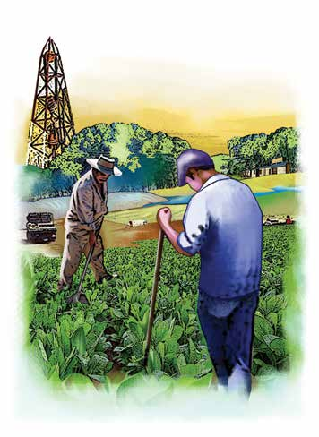
Unidad y
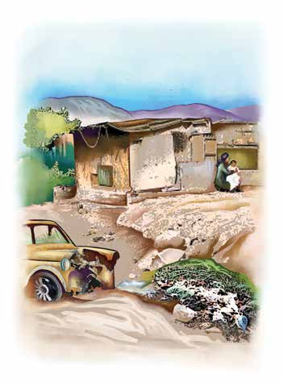
diversidad
en la Tierra
¿En qué se parecen estas comunidades?
> [!NOTE]
> Comenten las siguientes preguntas.
¿En cuál de las comunidades se podrá encontrar mayor cantidad de
recursos naturales? ¿Por qué?



UNIDAD 4

275

<!-- Página 277 -->

¿Cómo pueden influir los recursos de un lugar en la calidad de vida de
sus habitantes?
Nuestro
planeta,
la Tierra




¿Cómo puede lograrse un equilibrio entre el aprovechamiento de los
recursos naturales y la conservación y protección del ambiente?




Observa las siguientes imágenes.
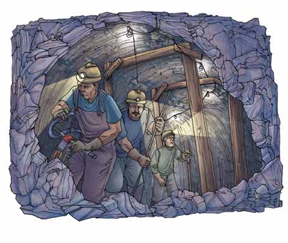

UNIDAD 4
276

<!-- Página 278 -->

¿Qué otras actividades dependen de los recursos naturales para ser
desarrolladas?
Unidad y
diversidad
en la Tierra




> [!NOTE]
> Recopila información de un periódico, libro, revista, o bien de la radio
> o la televisión relacionada con problemas originados por la contami-
> nación del ambiente y la sobreexplotación de los recursos naturales
> en la localidad donde vives. Anótalas en tu cuaderno y preséntalas al
> Círculo de estudio.
ecordemos que...
La contaminación afecta nocivamente al ambiente y a sus habitantes. A
partir del siglo anterior, como resultado de la Revolución industrial y el
gran desarrollo de las áreas urbanas, los problemas de contaminación del
aire, la tierra y el suelo han aumentado considerablemente. Los factores
contaminantes son residuos de cosas que hacemos, utilizamos y luego
eliminamos sin control alguno. Antes, las zonas contaminadas eran muy
reducidas; en nuestros días ha aumentado de manera descontrolada por
todo el planeta. Las relaciones del ser humano con el ambiente han causado
fuertes alteraciones en la vida de todos los ecosistemas. Sólo la participación
consciente y organizada de las personas puede hacer posible que se reduzcan
las actividades contaminantes.
UNIDAD 4
277

<!-- Página 279 -->

En la Tierra existe una gran diversidad de recursos, pero su distribución
no se realiza con equidad, es decir, en ocasiones son pocas las personas que
Nuestro
planeta,
los poseen y administran para obtener beneficios de ellos. En consecuencia,
la Tierra
existen miles de millones de personas que viven en la pobreza extrema, que no
tienen comida suficiente, ni agua ni forma de protegerse de las inclemencias
del ambiente. Muchos de ellos son los habitantes originarios de lugares donde
se encuentran las riquezas naturales y, aun así, no pueden utilizarlas. Existen
naciones que, por siglos, han mantenido el control de las riquezas que, por
derecho, pertenecen a otros países.
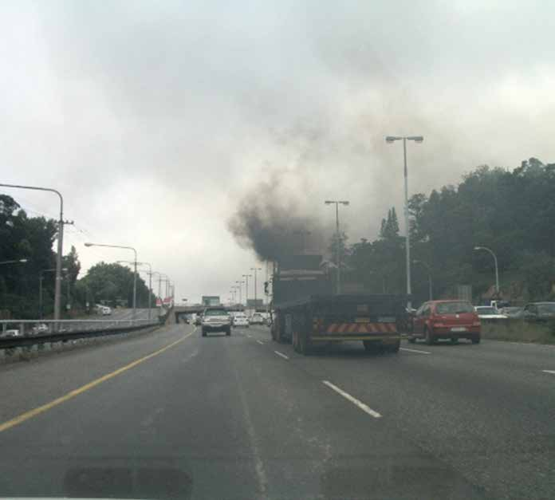
UNIDAD 4
278
