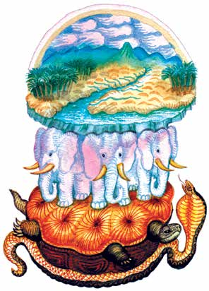
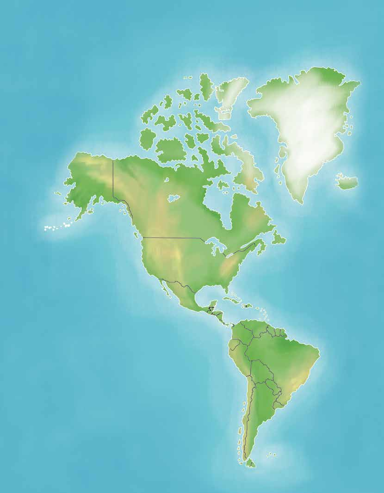
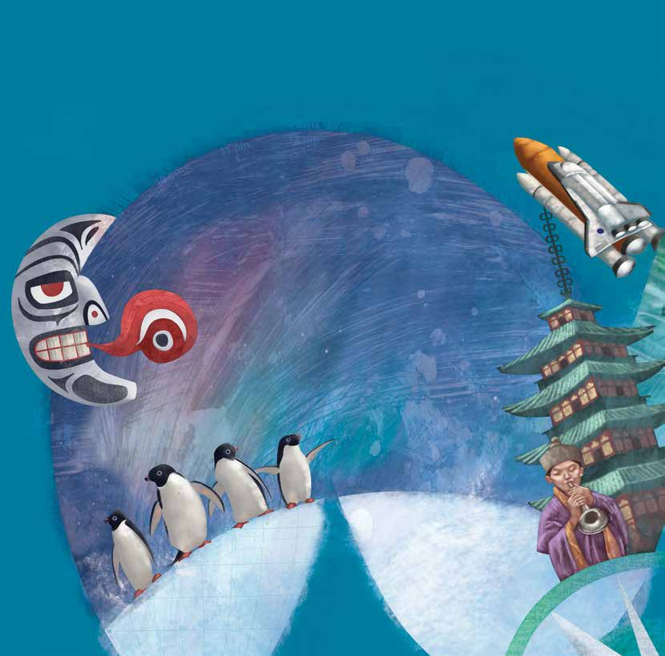
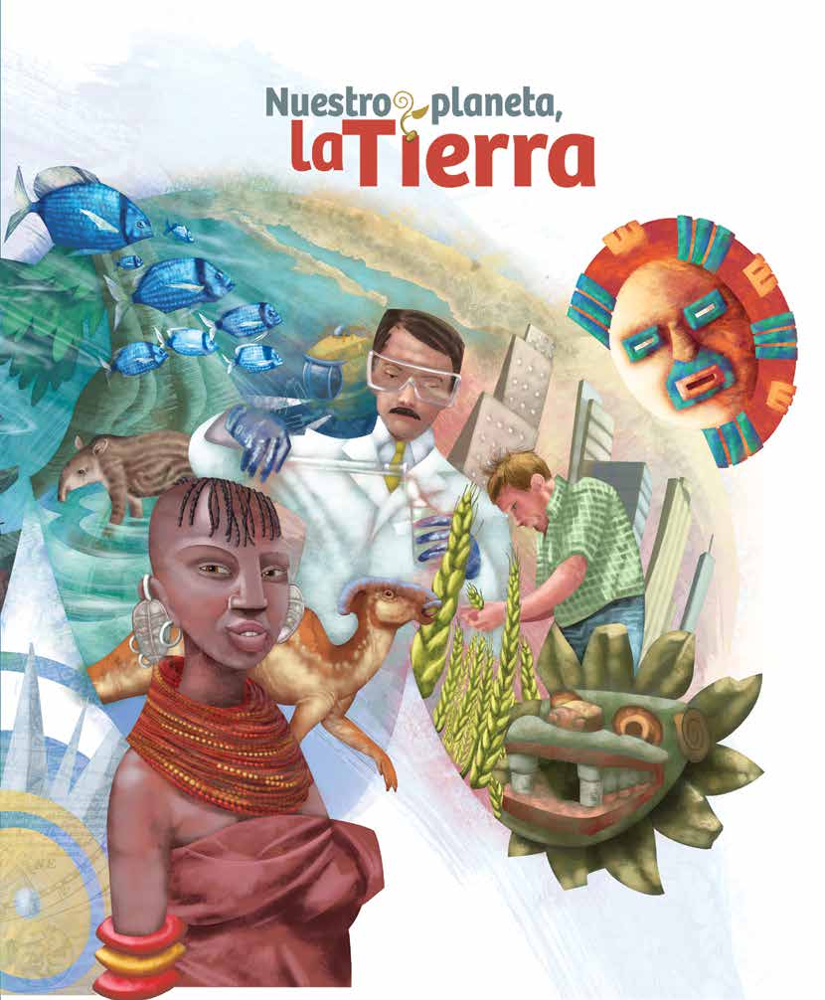
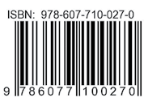

# Tema 4 y la vida cambian

<!-- Página 344 -->

> [!NOTE]
> Nuestras ideas acerca del mundo
Una mirada
al cielo
### Tema 4 y la vida cambian
> [!NOTE]
> A lo largo de la historia, los seres humanos hemos tenido distintas ideas de
> la forma de la Tierra, de su lugar en el universo, de las características de la
> vida y de todo lo que existe en el planeta. Estas ideas han evolucionado
> al ritmo de nuestros conocimientos y experiencias en el mundo.
ara empezar...
Observa la siguiente ilustración.

UNIDAD 5
343

<!-- Página 345 -->

Nuestro
planeta,
la Tierra
## L
os habitantes de Babilonia representaban a la Tierra como una montaña
hueca rodeada y sostenida por el mar. En su interior se encontraba el
oscuro reino de los muertos. El cielo sólido se encontraba arqueado sobre
la Tierra y se movían en él la Luna, el Sol y las estrellas.
Los egipcios se imaginaron a la Tierra como una

diosa encorvada y sostenida por el dios Sol.
Se ve al dios Sol navegando, como lo hacía
cada día, hacia la gran noche de la muerte.
En la India existieron diversas ideas sobre
la forma de la Tierra. Uno de los pueblos
imaginaba que ésta estaba sostenida por
elefantes que, cuando se movían, causaban
terremotos. Debajo de ellos se encontraba
una tortuga, la cual representaba a uno
de sus dioses, y descansaba en una cobra,
símbolo del agua.
UNIDAD 5
344

<!-- Página 346 -->

> [!NOTE]
> Dibuja en tu cuaderno una representación de la Tierra, de acuerdo
> con las ideas que tengas de ésta.
Una mirada
al cielo
¿Qué ha influido para que los seres humanos cambien sus ideas del mundo?
Señala con ✗ el paréntesis correspondiente a algunas de las posibles
causas de esos cambios.
> [!NOTE]
> (  )
> El momento y las circunstancias que les toca vivir.
> (  )
> Los descubrimientos logrados a lo largo de la historia.
> (  )
> Las ideas religiosas.
> (  )
> La observación de los fenómenos de la naturaleza.
> (  )
> La necesidad de contar con explicaciones de lo que sucede en el entorno.
Los primeros navegantes que viajaban por el mar lo hacían con temor, ya
que existía la idea de que el mundo era plano y tenía límites, por lo que en
un viaje prolongado los barcos enfrentaban el riesgo de caerse al vacío.
¿Cómo se transformarían los temores de esos navegantes una vez que
se comprobó que la Tierra era redonda?





Durante mucho tiempo se creyó que todo giraba alrededor de la Tierra y
UNIDAD 5
que, por lo tanto, ésta era el centro del universo.
345

<!-- Página 347 -->

¿Qué crees que pasó con estas ideas cuando se comprobó que la Tierra,
al igual que otros astros, gira alrededor del Sol y que el universo es infinito?
Nuestro
planeta,
la Tierra





En la historia de la humanidad se pueden identificar
grandes cambios en las formas de comprender e
interpretar el mundo.
Cuando los hombres y las mujeres, en
los inicios de su historia, descubrieron la
agricultura, pensaron que la fuerza de
la vida estaba en la naturaleza. La mujer es
símbolo de la fecundidad y la Tierra es la
fuente de la fecundidad de todas las cosas.
La madre Tierra, la Luna, la serpiente..., son
las diosas de la creación.
Durante los siglos XV y XVI, se dieron cambios
que produjeron una gran transformación en
las personas y en la sociedad. Surgieron diferencias
religiosas y luchas por el poder político; el uso del dinero para lucrar
tuvo un gran impulso. Nacieron también nuevas ideas sobre la forma y
los movimientos de la Tierra, que propiciaron viajes y descubrimientos
geográficos importantes.
Para el ser humano de la actualidad, sus ideas del mundo ya no sólo
se basan en lo que tiene ante sus ojos, sino que ahora se profundiza
UNIDAD 5
en el estudio de los componentes del universo, tanto de las estrellas que
346

<!-- Página 348 -->

se encuentran distantes de la Tierra como de las partículas infinitamente
pequeñas que no se pueden ver a simple vista. Gracias a los adelantos
Una mirada
al cielo
en los medios de comunicación y en los satélites artificiales, hoy sabemos
lo que ocurre en cualquier parte del mundo y lo que acontece fuera de
nuestro planeta.
Identifica en cada uno de los textos anteriores las ideas que influyeron en
esas diferentes formas de entender el mundo.
1. 

2. 

3. 

> [!NOTE]
> Escribe en tu cuaderno cómo piensas que será el mundo a finales del
> siglo XXI.
ecordemos que...
Las diferentes formas de entender e interpretar el mundo están relacionadas
con nuestras experiencias de vida y con la información que tenemos acerca
de su origen y de lo que existe en él. En la medida en que nos interesemos
por conocer mejor lo que nos rodea y las características de nuestro planeta,
tendremos mayores posibilidades de participar en la conservación de la
vida. Reconocer que los seres humanos formamos parte del universo es
un privilegio y una responsabilidad que nos deben conducir a respetar el
UNIDAD 5
derecho de la Tierra y de todos sus habitantes.
347

<!-- Página 349 -->

uestros avances
Nuestro
planeta,
1. Describe qué es el universo.
la Tierra



2. Escribe tres de las características del sistema solar que te parezcan
importantes.



3. ¿Qué utilidad tienen para las personas las ideas que explican la forma
en que ha evolucionado la vida en la Tierra?



4. ¿Por qué se dice que algunos fenómenos que observamos en la
Tierra, como los eclipses y las estaciones del año, se explican por los
movimientos de algunos cuerpos que están en el cielo?



Elabora en tu cuaderno un texto en el que describas por qué cambian nues-
UNIDAD 5
tras formas de explicar y comprender lo que significan el mundo y la vida.
348

<!-- Página 350 -->

¿Qué he aprendido y para qué me sirve?
Una mirada
al cielo
Unidad 5. Una mirada al cielo
Temas:
1. La Tierra, nuestra casa en el universo
2. Origen y evolución de la vida
3. Estaciones, eclipses y mareas
4	 Nuestras ideas acerca del mundo y la vida cambian
¿Qué aprendí en esta unidad?



¿Qué debo repasar?



¿Para qué me sirve lo que he aprendido en esta unidad?



UNIDAD 5
349

<!-- Página 351 -->

Revisemos lo aprendido
Nuestro
planeta,
Al llegar a esta página tendrás una nueva oportunidad de aplicar lo apren-
la Tierra
dido en este módulo. Hacerlo no sólo consiste en responder en forma oral o
por escrito una pregunta, sino también compartir con otros tus aprendizajes y,
sobre todo, participar en la solución de algunos de los problemas revisados.
1. Te invitamos a que converses con una persona cercana a ti y, junto
con ella, imaginen qué pasaría si...
a)	 En nuestra casa se usaran recipientes distintos para la basura,
uno para depositar materiales que pueden reciclarse —papel,
cartón, alambre, latas, vidrio—, y otro para depositar desechos
que no se pueden reciclar.
b)	 No se desperdiciara agua al realizar las labores en las que
hacemos uso de este preciado y, cada vez más, escaso líquido.
c)	 Sólo se utilizara la luz que fuese necesaria y la flama de la estufa
se encendiera lo más bajo posible.
d)	 Evitáramos comprar plantas o animales que están en peligro de
extinción.
e)	 Todos los humanos sintiéramos que somos parte de la naturaleza
y que los daños que le causamos a ella afectan a la Tierra en su
conjunto.
Ahora es tu turno; agrega otras ideas que consideres importantes para
conservar la Tierra.
2. Anota las ideas que más llamaron tu atención durante la conversación
anterior y coméntalas con el grupo.


UNIDAD 5

350

<!-- Página 352 -->

3. Preguntas como, ¿de dónde venimos?, ¿qué somos?, ¿por qué vivimos?,
entre otras, son el motor que guía nuestra necesidad de saber.
Una mirada
al cielo
a)	 Explica, brevemente, qué temas del módulo te fueron útiles para
encontrar nuevas respuestas a algunas de las preguntas anteriores.




b)	 ¿Sobre qué pregunta te gustaría continuar investigando? ¿Qué
procedimientos utilizarías?





4. De los temas revisados, ¿cuál modificó algunas de tus ideas, creencias,
sentimientos o actitudes?, ¿y cómo?




UNIDAD 5

351

<!-- Página 353 -->

5. Explica qué significa la palabra “biodiversidad” y qué factores la ponen
en peligro.
Nuestro
planeta,
la Tierra




6. Si se tiene conocimiento de que la vida en la Tierra ha evolucionado
durante millones de años, mientras que algunas acciones de los seres
humanos sólo necesitan unos minutos para destruirla, ¿qué deberían
hacer los siguientes grupos o instituciones para frenar o disminuir
estas acciones destructivas?
Escuela:



Gobierno:



Sociedad:


UNIDAD 5

352

<!-- Página 354 -->

Completa las frases de la columna de la izquierda con la información de
la columna de la derecha uniéndolas con una línea, según corresponda.
Una mirada
al cielo
a)	la Luna.
1. Los planetas giran en órbita
alrededor del Sol debido a…
b)	la energía.
2. El centro del sistema solar es…
c)	 la fuerza de gravedad.
3. El satélite natural de la Tierra es…
d)	el Sol.
4. Regresa parte de las radiaciones
que emite el Sol…
e)	 la atmósfera.
5. Se transforma en movimiento…
Ahora que terminó el módulo
Te recomendamos que contestes las siguientes preguntas cuando hayas
terminado el apartado Revisemos lo aprendido.
1. ¿Qué dificultades tuviste para resolver el apartado Revisemos lo
aprendido?






UNIDAD 5

353

<!-- Página 355 -->

2. ¿Qué más te gustaría aprender sobre los temas tratados en el módulo
Nuestro planeta, la Tierra?
Nuestro
planeta,
la Tierra




Junto con tu asesor revisa nuevamente los propósitos del módulo Nuestro
planeta, la Tierra, que son los siguientes:
Propósitos del módulo Nuestro planeta, la Tierra
- Reconocer algunos procedimientos utilizados en el estudio de la
naturaleza y de la sociedad y aplicarlos para mejorar la comprensión
del mundo que habitamos.
- Analizar algunos de los componentes que hacen posible la vida en
nuestro planeta y las características de las cosas y los seres que lo
constituyen.
- Apreciar las características más importantes de la Tierra como parte
del universo, para participar responsablemente en el cuidado y
preservación de la vida en el planeta.
¿Crees que lograste los propósitos que acabas de leer?
Sí
No
¿Por qué?


UNIDAD 5

354

<!-- Página 356 -->

Píde a tu asesor que lea y comente lo que escribiste en la sección ¿Qué
he aprendido y para qué me sirve?, y que escriba su opinión acerca de
Una mirada
al cielo
tu grado de avance a lo largo del módulo.




Tomando en cuenta los comentarios de tu asesor y tu propia opinión,
¿consideras que mereces recibir tu Constancia de Participación en el
módulo Nuestro planeta, la Tierra?
Sí
No
¿Por qué?




¡Felicidades!
Firma de la asesora o asesor
UNIDAD 5
355

<!-- Página 357 -->

Nuestro
planeta,
la Tierra
Groenlandia
Alaska
Islandia
Canadá
> [!NOTE]
> Países de Europa
> 1.	 Albania
> 20.	 Irlanda
> 21.	 Islandia
> 2.	 Alemania
> 22.	 Italia
> 3.	 Andorra
> 23.	 Letonia
> 4	 Austria
> 24.	 Lituania
> 5.	 Bélgica
> 25.	 Luxemburgo
> 6.	 Bielorrusia
> 26.	 Macedonia
> 7.	 Bosnia-Herzegovina
> 27.	 Malta
> 8.	 Bulgaria
> 28.	 Moldavia
> 9.	 Croacia
> 29.	 Noruega
> 10.	 Dinamarca
> 30.	 Polonia
> 11.	 Eslovaquia
> 31.	 Portugal
> 12.	 Eslovenia
> 32.	 Reino Unido
> 13.	 España
> 33.	 República Checa
> 14.	 Estonia
> 34.	 Rumania
> 15.	 Finlandia
> 35.	 Serbia
> 16.	 Francia
> 36.	 Suecia
> 17.	 Grecia
> UNIDAD 5
> 37.	 Suiza
> 18.	 Holanda
> 38.	 Ucrania
> 19.	 Hungría
Estados Unidos de América
Bahamas
República Dominicana
Haití
Puerto Rico
Cuba
México
Venezuela
Belice
Trinidad y Tobago
Honduras
Guatemala
Guayana
El  Salvador
Surinam
Colombia
Guyana Francesa
Nicaragua
Costa Rica
Brasil
Perú
Bolivia
Panamá
Ecuador
Paraguay
Uruguay
Chile
Argentina
Islas
Malvinas
356

<!-- Página 358 -->

> [!NOTE]
> Países de África
> 45. 	 Gambia
> 51.	 República Centroafricana
> 39. 	 Benín
> 46. 	 Ghana
> 52. 	 Senegal
> 40. 	Bissau
> 47.	 Guinea
> 53. 	 Sierra Leona
> 41. 	 Burkina Faso
> 48. 	 Guinea Ecuatorial
> 54. 	 Sahara
> 42.  Costa de Marfil
> 49. 	 Liberia
> 55. 	 Togo
> 43.	 Eritrea
> 50. 	 Marruecos
> 56. 	 Túnez
> 44. 	Gabón

Una mirada
al cielo
Rusia
Finlandia
Suecia
Noruega
Azerbaiyán
Kazajstán
Turkmenistán
Mongolia
Armenia
Kirguizistán
Uzbekistán
Georgia
Corea del Norte
Turquía
Tayikistán
Afganistán
China
Israel
Siria
Japón
Nepal
Irán
Líbano
Irak
Pakistán
Argelia
Jordania
Libia
Corea del Sur
Egipto
Myanmar
Mauritania
Kuwait
Arabia
India
Saudita
Catar
Laos
Taiwán
Malí
Níger
Emiratos
Chad
Yemen
Bhután
Sudán
Vietnam
Árabes Unidos
Yibuti
Nigeria
Filipinas
Tailandia
Camerún
Camboya
Etiopía
Omán
Somalia
40 53
Brunéi
Malasia
Sri Lanka
Uganda
Congo
Nueva Guinea
Kenia
Bangladesh
Rep. Dem.
Indonesia
Ruanda
Singapur
Congo
Tanzania
Burundi
Timor
Angola
Zambia
Oriental
Malawi
Madagascar
Botswana
Namibia
Australia
Nueva
Mozambique
Zelanda
Swazilandia
Sudáfrica
Zimbabwe
Lesotho
Tazmania
UNIDAD 5
357

<!-- Página 359 -->

otas





















<!-- Página 360 -->

> [!NOTE]
> manera natural y por la acción
> u objetos que se encuentran en el
> les y el movimiento de los cuerpos
> Distingue las características más
> universo han ido cambiando con
> importantes del universo, del
> Explica las relaciones que existen
> Identifica las formas en que la
> Tierra cambia y evoluciona de
> Aprecia cómo sus ideas sobre el
> entre algunos fenómenos natura-
> Hago constar que se completó
> satisfactoriamente esta unidad.
> Una mirada al cielo
> Nombre y firma del asesor/a
> sistema solar y de la Tierra.
> Unidad 5
> de los seres humanos.
> el tiempo.
> Fecha
> cielo.
> relacionan entre sí y con su
> su comunidad y plantea medidas
> habitan en México y en otras
> cipales problemas ambientales de
> de recursos naturales y culturales
> para realizar acciones que los
> ambiente los seres vivos que
> Reconoce y valora la diversidad
> Comprende y explica cómo se
> Identifica las causas de los prin-
> Hago constar que se completó
> satisfactoriamente esta unidad.
> Unidad y diversidad
> Nombre y firma del asesor/a
> en la Tierra
> Unidad 4
> conserven o recuperen.
> partes del mundo.
> de solución.
> Fecha
> La naturaleza y la sociedad se
> energía que hay y su influencia en
> tienen en la naturaleza y en
> los cambios y transformación de
> Analiza las consecuencias que
> nuestra vida los cambios que
> la naturaleza y algunas de las
> Identifica los principales tipos de
> tipos de cambios que ocurren en
> producimos en nuestro entorno.
> Hago constar que se completó
> satisfactoriamente esta unidad.
> Nombre y firma del asesor/a
> transforman
> causas que los propician.
> Unidad 3
> Reconoce los diferentes
> la naturaleza.
> Fecha
> Valora la utilidad de formar grupos
> Reconoce las características de
> los principales grupos de seres
> Distingue las características de
> conocer mejor el mundo en que
> como una manera de estudiar y
> artificiales, de lo vivo y de lo no
> las cosas naturales y de las cosas
> componentes de la naturaleza y
> Identifica a los seres vivos como
> Qué hay en nuestro planeta
> lo que éstos necesitan para vivir.
> Hago constar que se completó
> satisfactoriamente esta unidad.
> Nombre y firma del asesor/a
> Unidad 2
> vivimos.
> Fecha
> vivos.
> vivo.
> utiliza para conocer su entorno
> utiliza para conocer, así como
> los conocimientos obtenidos a lo
> Aprecia la utilidad, en lo individual
> para explicar y transformar el
> Valora los procedimientos que
> Mejora los procedimientos que
> y en lo social, de los conocimientos
> Hago constar que se completó
> satisfactoriamente esta unidad.
> Exploremos el mundo
> Nombre y firma del asesor/a
> Unidad 1
> largo de su vida.
> natural y social.
> mundo.
> Fecha
Apellido materno	                  Nombre(s)
RFE o CURP
Nuestro planeta, la Tierra
Hoja de avances
Ciencias
Apellido paterno
Marca con ✓ los temas de cada unidad
que se hayan completado satisfactoriamente.
Nombre de la persona joven o adulta

<!-- Página 361 -->

> [!NOTE]
> Lugar de la aplicación
> Fecha
> Datos de la aplicación
> ——————————————————————————
> Nombre y firma del aplicador/a
> [!NOTE]
> ——————————————————————————
> ——————————————————————————
> ——————————————————————————
> ——————————————————————————
> ——————————————————————————
> ——————————————————————————
> ——————————————————————————
> ——————————————————————————
> ——————————————————————————
> ——————————————————————————
> ——————————————————————————
> ——————————————————————————
> ¿Qué aprendí?
> ——————————————————————————
> Nombre y firma de la persona joven o adulta
> ——————————————————————————
> ——————————————————————————
> ——————————————————————————
> ——————————————————————————
> ——————————————————————————
> ——————————————————————————
> ——————————————————————————
> ——————————————————————————
> ——————————————————————————
> ——————————————————————————
> ——————————————————————————
> ——————————————————————————
> ¿Para qué me sirve?
Nuestro planeta, la Tierra
Hoja de avances
Ciencias
Autoevaluación final

<!-- Página 362 -->

En la vida diaria tratamos de cuidar nuestra
casa y todo lo que hay en ella, pues eso nos
trae beneficios y nos hace sentir bien. El pla-
neta Tierra es también una gran casa en la que
vivimos y nos relacionamos los seres humanos,
las plantas y los animales. Pero, ¿cuántas ve-
ces nos hemos preocupado por cuidarlo?, ¿tú
qué estás haciendo?, ¿te gustaría saber cómo
contribuir a que nuestro planeta se conserve
en las mejores condiciones para que nosostros
y las futuras generaciones podamos disfrutar-
lo? Las respuestas a éstas y otras preguntas
las encontrarás en este libro. En sus páginas
conocerás cómo nació la Tierra, quiénes vi-
ven en este planeta, cómo está formado el
aire, cómo se produce la energía, cuáles son
los paisajes de México y el mundo, así como
qué puedes hacer para proteger el ambiente,

entre muchas cosas más.

DISTRIBUCIÓN GRATUITA
Este programa es público, ajeno a cualquier partido político. Queda prohibido su uso para fines distintos a los establecidos en el programa.
